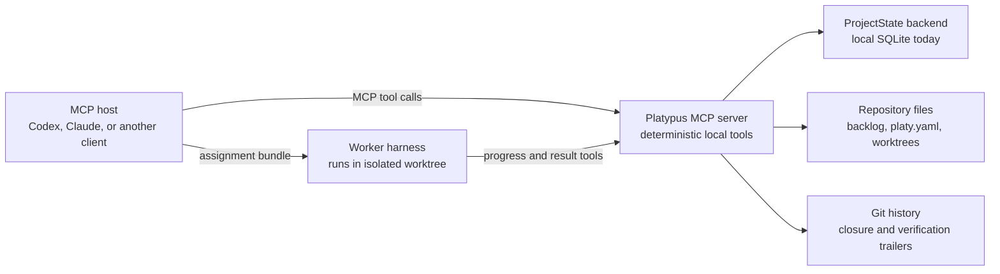

# Platypus MCP (Rust)

This repository contains the Rust MCP server for Platypus. The MCP contract is
the product boundary for Codex, Claude, and other harnesses: clients own the
chat session, while this server exposes deterministic project-management tools.

## Current scope

Platypus currently supports project initialization, backlog authoring,
deterministic task dispatch, isolated Git worktrees, worker handoff bundles,
worker progress/result recording, approvals, events, findings, evidence,
workflow integration configuration, and reconciliation.

Use `inspect_session` at startup or after stale chat context. Use
`inspect_work_queue` to inspect executable backlog work, dependency-blocked and
closed item summaries, task-plan state, active lifecycle state, and setup
blockers. Use `inspect_item` for the full state of one backlog item. Use
`prepare_work` to get either direct-edit guidance or a host-run worktree
handoff. Direct edits finish with `complete_backlog_item`; worker handoffs
finish with `finish_work` so worker completion, verification, findings,
integration guidance, and reconciliation stay connected.
For tiny user-approved edits, the minimum tracked loop is `inspect_session`,
queue inspection, edit the manager workspace, verify, and
`complete_backlog_item`. When queue output says `prepare_work_optional=true`,
`prepare_work` is only response-local guidance; use task plans and worker
handoff when traceability, parallelism, or review gates matter.
The minimal direct-work example in [docs/workflow.md](docs/workflow.md#minimal-direct-work-example)
shows `create_backlog_items`, `inspect_work_queue`, direct edits, and
`complete_backlog_item` with automatic evidence.
The preferred workflow is documented in [docs/workflow.md](docs/workflow.md),
client setup is documented in [docs/install.md](docs/install.md), and the full
tool surface is documented in [docs/tools.md](docs/tools.md).

The roadmap now tracks the landed MCP baseline and candidate next directions
instead of a manual queue index. See [docs/roadmap.md](docs/roadmap.md) for the
current product direction.

## Product Boundary



The host manages chat, model context, and worker execution. Platypus manages
the durable project state transitions that must be deterministic, inspectable,
and recoverable.

## Structure

- `src/main.rs`: stdio entrypoint
- `src/server.rs`: RMCP server and tool router
- `src/models.rs`: public tool request and response schemas
- `src/backlog/`: backlog parsing, validation, listing, drafting, and creation
- `src/storage/`: current SQLite reference implementation and migration
  scaffolding for the domain-shaped `ProjectState` boundary; see
  [docs/storage.md](docs/storage.md)
- `docs/diagrams.md`: repository-level Mermaid diagrams from multiple
  perspectives
- `docs/install.md`: local build, smoke-test, Codex, and Claude configuration
- `docs/workflow.md`: current MCP host workflow
- `docs/roadmap.md`: product direction and near-term roadmap

Keep new behavior in focused modules. Avoid adding large all-purpose files.

## Backlog State Model

Backlog markdown is intentionally declarative. Items describe intent,
constraints, dependencies, surfaces, and acceptance criteria. They do not carry
runtime fields such as status, assignment, PRs, task attempts, or closure
metadata.

Non-trivial items can have committed task plans under `backlog/plans/*.yaml`.
Plans contain strict, reviewable requirements, design summaries, and planned
worker tasks. They also stay free of runtime fields such as status, commit,
attempts, results, or evidence.

Closure is derived from reachable Git trailers:

```text
Platypus-Closes: MCP-123
Platypus-Verification: make check
```

Runtime state such as queued/running tasks, task events, findings, claims, and
future worker attempts belongs behind the `ProjectState` backend boundary.
The current local backend stores it in `.platy/platypus.sqlite3`.

SQLite is the local-first reference backend, not a permanent product boundary.
MCP tools should depend on Platypus domain operations such as dispatching work,
preparing assignments, completing worker execution, replaying events, and
reconciling state, not on SQL-shaped repositories. Future shared runtime
backends must preserve the same MCP schemas, event ordering, lease semantics,
conflict behavior, recovery paths, and reconciliation rules documented in
[docs/storage.md](docs/storage.md). Local SQLite support remains a first-class
mode even if shared coordination is added later.

External trackers are integration surfaces, not the hidden source of execution
truth. Platypus imports approved external records into local backlog snapshots;
future reporting back to GitHub, Linear, Jira, or other systems should happen
through explicit approved tools and provider-neutral payloads.

## Verify

```bash
make check
```

List available developer workflows:

```bash
make help
```

## Run

Install the released crate:

```bash
cargo install platypus-mcp
```

The Pi npm package resolves the MCP binary in this order: `PLATYPUS_MCP_BIN`, a
package-local or optional platform prebuilt binary, a development checkout
`Cargo.toml` fallback, then `platypus-mcp` on `PATH`. Normal npm installs should
not need to compile Rust during postinstall. Release validation currently
stages and checks Linux x64, Linux arm64, macOS Intel (`darwin-x64`), and Apple
silicon (`darwin-arm64`) package-local binaries under
`vendor/<platform>/platypus-mcp`. Validate npm package contents with:

```bash
make pi-extension-test
make npm-package
```

The GitHub `Publish` workflow publishes both the crates.io package and the
`platypus-pi` npm package from releases. npm publishing requires repository
secret `NPM_TOKEN`; manual workflow dispatch defaults to dry-run validation.

Run the installed stdio server:

```bash
platypus-mcp
```

Configure an MCP host to use the installed server:

```bash
platypus-mcp bootstrap codex
platypus-mcp bootstrap claude
platypus-mcp bootstrap opencode
platypus-mcp bootstrap pi
```

For a fresh project, configure the host and initialize repo-local guidance in
one step:

```bash
platypus-mcp bootstrap pi --root /path/to/project --init-project
```

Inspect before writing or check an existing setup:

```bash
platypus-mcp bootstrap codex --dry-run
platypus-mcp bootstrap codex --check
platypus-mcp bootstrap pi --root /path/to/project --check --init-project
```

During local development:

```bash
make run
```

Invoke one MCP tool through the stdio contract for local smoke testing:

```bash
make smoke
make smoke-queue
make smoke-storage
```

Inspect the current workflow integration policy:

```bash
PLATYPUS_MCP_ROOT=/path/to/project cargo run
```

Then call the MCP tool `inspect_workflow_config` from the host.

By default the server uses the current directory as the Platypus project root.
Set `PLATYPUS_MCP_ROOT` to bind tools to a specific project:

```bash
PLATYPUS_MCP_ROOT=/path/to/project cargo run
```

## Client Configuration

Use stdio while the tool contract stabilizes.

Prefer the bootstrap command for supported MCP hosts:

```bash
platypus-mcp bootstrap codex
platypus-mcp bootstrap claude
platypus-mcp bootstrap opencode
platypus-mcp bootstrap pi
```

This repository also contains a Pi package manifest and extension. `bootstrap
pi` writes Pi's native project settings file (`.pi/settings.json`) with
`npm:platypus-pi` in `packages`, and `--init-project` creates the Platypus
project guidance in the same pass. During local checkout development,
`.pi/settings.json` can load the package from `..`, so Pi starts with
`platypus_*` tools available in this repository. To try the same extension from
another project before publishing, install this checkout or a Git URL as a Pi
package:

```bash
cd /path/to/other-project
pi install -l /path/to/platypus-mcp
# or later: pi install -l git:github.com/junousia/platypus-mcp
```

The extension forwards each `platypus_*` Pi tool to the Rust tool CLI with the
Platypus root fixed to Pi's current working directory. The normal Pi workflow
uses dedicated typed tools for startup and execution, including
`platypus_inspect_session`, `platypus_inspect_work_queue`,
`platypus_create_backlog_items`, `platypus_prepare_work`,
`platypus_complete_backlog_item`, `platypus_finish_work`,
`platypus_record_evidence`, `platypus_record_finding`, `platypus_list_findings`,
`platypus_update_finding_disposition`, and `platypus_doctor_snapshot`.
`platypus_call_tool` remains available only as a generic escape hatch for tools
that do not yet have a dedicated Pi wrapper.

The Pi extension has deterministic local harness tests for command prompt
generation, tool execution wrappers, binary resolution guidance, and renderer
fixtures. Run them with `make pi-extension-test`; `make check` includes them.
Run `make pi-feedback` to create an isolated temporary Pi project, bootstrap the
local package, validate core Platypus tools, and write a dry-run `FEEDBACK.md`.
Use `PI_DRY_RUN=0 make pi-feedback` for a live Pi/model exercise.

The Pi happy path is intentionally short:

1. `/platy-refresh` or `/platy-ready` shows current queue state.
2. `/platy-direction` asks the agent to capture durable product, architecture,
   and testing direction in repository docs when direction is missing or stale.
3. `/platy-standards` asks the agent to capture module boundaries, code
   organization, verification, UI, review, evidence, and definition-of-done
   expectations in `docs/engineering.md`.
4. `/platy-story-review` asks the agent to review a draft or existing backlog
   item for concrete goal, acceptance criteria, dependencies, planning mode,
   owned surfaces, and expected evidence before execution.
5. `/platy-plan-review` asks the agent to produce a lightweight implementation
   review for the next ready item or a selected item, creating durable task
   plans only when policy or user approval calls for them.
6. `/platy-review-result` asks the agent to compare implemented work against
   acceptance criteria, verification, findings, follow-ups, and the definition
   of done before completing direct or worker-handoff work.
7. `/platy-plan` asks the agent to create concrete backlog items when the queue
   is empty.
8. `/platy-start` asks the agent to work the next ready item and complete it
   with `platypus_complete_backlog_item`.
9. `/platy-direction-revise` and `/platy-standards-revise` revisit captured
   guidance without rerunning the whole setup flow.
10. `/platy-doctor` shows setup or recovery guidance when work is blocked.

Add `--init-project` for fresh repositories so `AGENTS.md`, `CLAUDE.md`,
`WORKFLOW.md`, `platy.yaml`, `backlog/`, durable direction files, and
engineering standards under `docs/` are created alongside host MCP
configuration or Pi package settings.

If your host defers tool schemas, read resource
`platypus://guidance/tool-preload` or prompt `platypus-tool-preload` at session
start, or call `inspect_toolsets`. Toolsets are advisory discovery metadata for
startup, backlog planning, direct execution, worker handoff, evidence/findings,
and recovery. They are not required workflow steps and not separate MCP
servers; hosts without preload support can call the same tools when they are
needed.

Codex-style configuration:

```toml
[mcp_servers.platypus]
command = "platypus-mcp"
args = []
env = { PLATYPUS_MCP_ROOT = "/path/to/project" }
```

For source checkouts, use:

```toml
[mcp_servers.platypus]
command = "cargo"
args = ["run", "--manifest-path", "/path/to/platypus-mcp/Cargo.toml", "--quiet"]
env = { PLATYPUS_MCP_ROOT = "/path/to/project" }
```

Claude-style configuration:

```json
{
  "mcpServers": {
    "platypus": {
      "command": "platypus-mcp",
      "args": [],
      "env": {
        "PLATYPUS_MCP_ROOT": "/path/to/project"
      }
    }
  }
}
```
