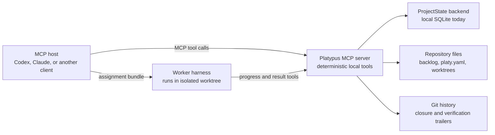

# Platypus MCP (Rust)

This repository contains the Rust MCP server for Platypus. The MCP contract is
the product boundary for Codex, Claude, and other harnesses: clients own the
chat session, while this server exposes deterministic project-management tools.

## Current scope

Platypus currently supports project initialization, backlog authoring,
deterministic task dispatch, isolated Git worktrees, worker handoff bundles,
worker progress/result recording, approvals, events, findings, evidence, agent
profiles, workflow integration configuration, and reconciliation.

Use `inspect_work_queue` to choose executable backlog work and
`classify_planning_needs` to explain whether an item needs direct, standard, or
full planning. Use `next_safe_action` as the host-facing guide for the next safe
lifecycle tool call.
The preferred workflow is documented in [docs/workflow.md](docs/workflow.md),
client setup is documented in [docs/install.md](docs/install.md), and the full
tool surface is documented in [docs/tools.md](docs/tools.md).

Near-term work now focuses on tightening integration evidence, reconciliation,
full lifecycle smoke coverage, and MCP host guidance. That roadmap is
documented in [docs/roadmap.md](docs/roadmap.md).

## Product Boundary



The host manages chat, model context, and worker execution. Platypus manages
the durable project state transitions that must be deterministic, inspectable,
and recoverable.

## Structure

- `src/main.rs`: stdio entrypoint
- `src/server.rs`: RMCP server and tool router
- `src/models.rs`: public tool request and response schemas
- `src/backlog/`: backlog parsing, validation, listing, drafting, and creation
- `src/storage/`: current SQLite reference implementation and migration
  scaffolding for the domain-shaped `ProjectState` boundary; see
  [docs/storage.md](docs/storage.md)
- `docs/diagrams.md`: repository-level Mermaid diagrams from multiple
  perspectives
- `docs/install.md`: local build, smoke-test, Codex, and Claude configuration
- `docs/workflow.md`: current MCP host workflow
- `docs/roadmap.md`: product direction and near-term roadmap

Keep new behavior in focused modules. Avoid adding large all-purpose files.

## Backlog State Model

Backlog markdown is intentionally declarative. Items describe intent,
constraints, dependencies, surfaces, and acceptance criteria. They do not carry
runtime fields such as status, assignment, PRs, task attempts, or closure
metadata.

Non-trivial items can have committed task plans under `backlog/plans/*.yaml`.
Plans contain strict, reviewable requirements, design summaries, and planned
worker tasks. They also stay free of runtime fields such as status, commit,
attempts, results, or evidence.

Closure is derived from reachable Git trailers:

```text
Platypus-Closes: MCP-123
Platypus-Verification: make check
```

Runtime state such as queued/running tasks, task events, findings, claims, and
future worker attempts belongs behind the `ProjectState` backend boundary.
The current local backend stores it in `.platy/platypus.sqlite3`.

SQLite is the local-first reference backend, not a permanent product boundary.
MCP tools should depend on Platypus domain operations such as dispatching work,
preparing assignments, completing worker execution, replaying events, and
reconciling state, not on SQL-shaped repositories. Future shared runtime
backends must preserve the same MCP schemas, event ordering, lease semantics,
conflict behavior, recovery paths, and reconciliation rules documented in
[docs/storage.md](docs/storage.md). Local SQLite support remains a first-class
mode even if shared coordination is added later.

External trackers are integration surfaces, not the hidden source of execution
truth. Platypus imports approved external records into local backlog snapshots;
future reporting back to GitHub, Linear, Jira, or other systems should happen
through explicit approved tools and provider-neutral payloads.

## Verify

```bash
make check
```

List available developer workflows:

```bash
make help
```

## Run

```bash
make run
```

Run the local preparation runner:

```bash
make runner
```

Invoke one MCP tool through the stdio contract for local smoke testing:

```bash
make smoke
make smoke-queue
make smoke-storage
```

Inspect the current workflow integration policy:

```bash
PLATYPUS_MCP_ROOT=/path/to/project cargo run
```

Then call the MCP tool `inspect_workflow_config` from the host.

By default the server uses the current directory as the Platypus project root.
Set `PLATYPUS_MCP_ROOT` to bind tools to a specific project:

```bash
PLATYPUS_MCP_ROOT=/path/to/project cargo run
```

## Client Configuration

Use stdio while the tool contract stabilizes.

Codex-style configuration:

```toml
[mcp_servers.platypus]
command = "cargo"
args = ["run", "--manifest-path", "/path/to/platypus-mcp-rs/Cargo.toml"]
env = { PLATYPUS_MCP_ROOT = "/path/to/project" }
```

Claude-style configuration:

```json
{
  "mcpServers": {
    "platypus": {
      "command": "cargo",
      "args": ["run", "--manifest-path", "/path/to/platypus-mcp-rs/Cargo.toml"],
      "env": {
        "PLATYPUS_MCP_ROOT": "/path/to/project"
      }
    }
  }
}
```
