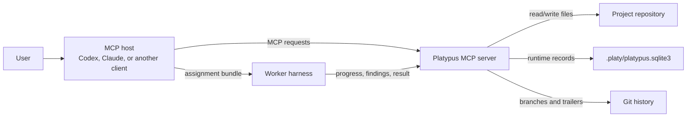
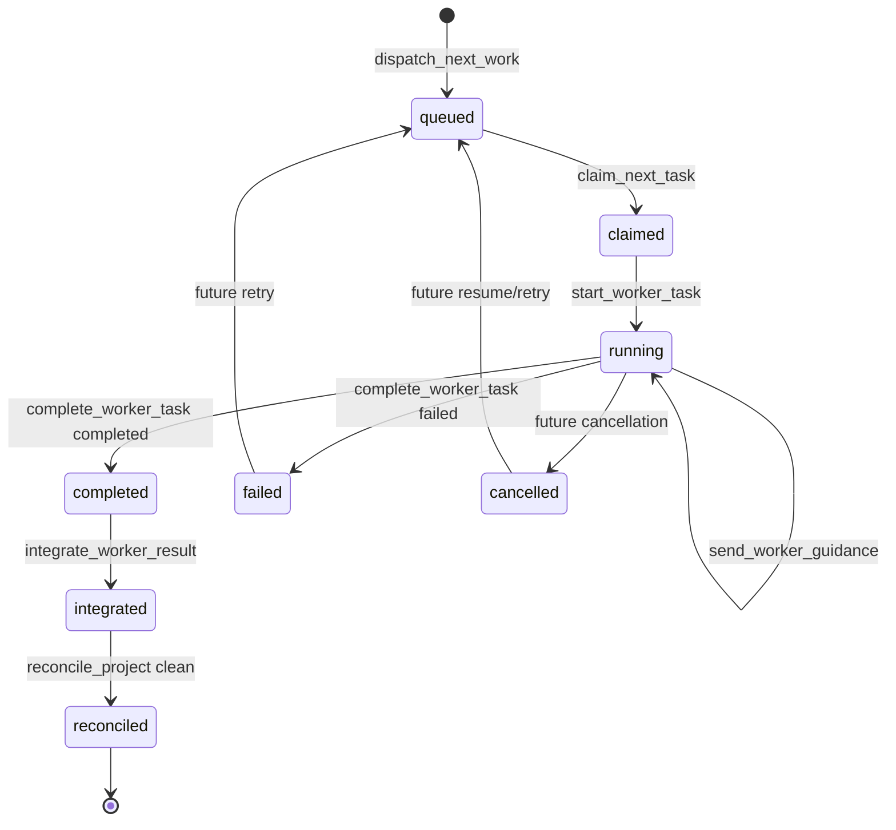
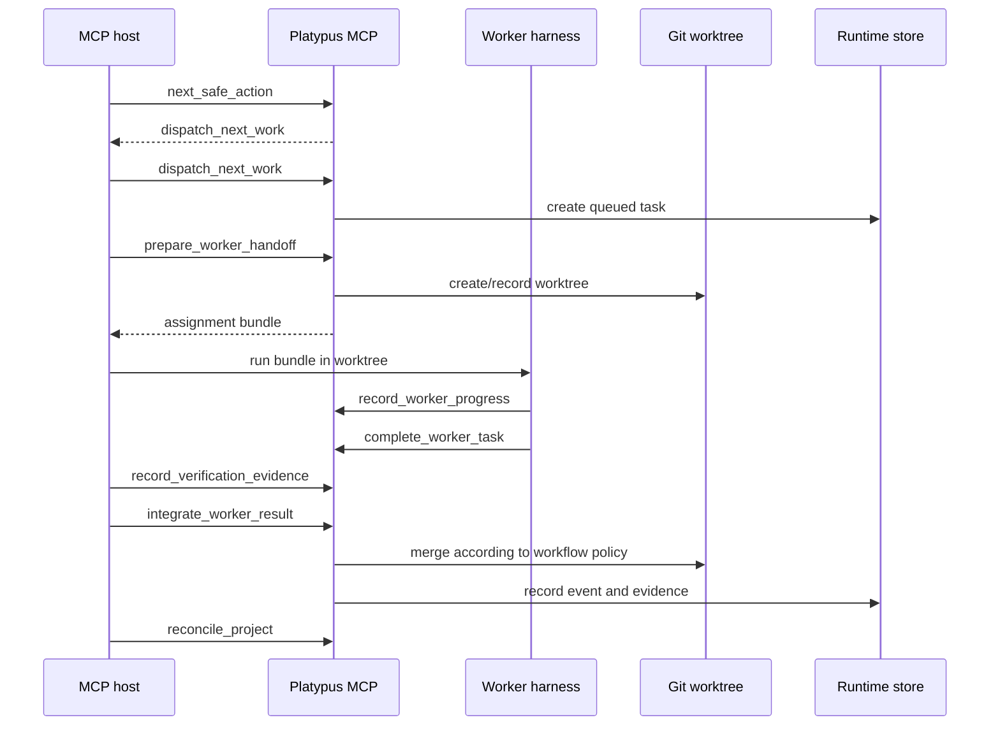
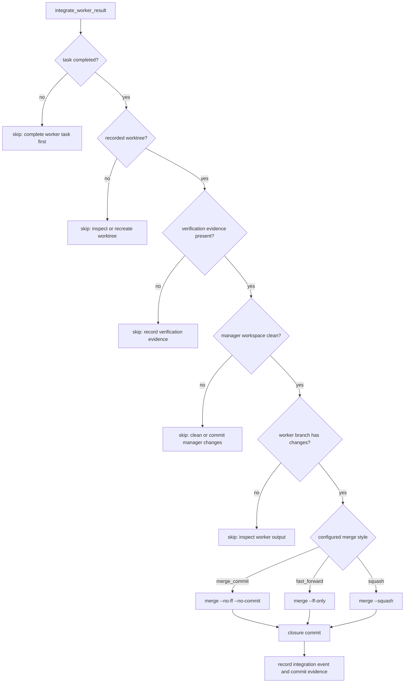
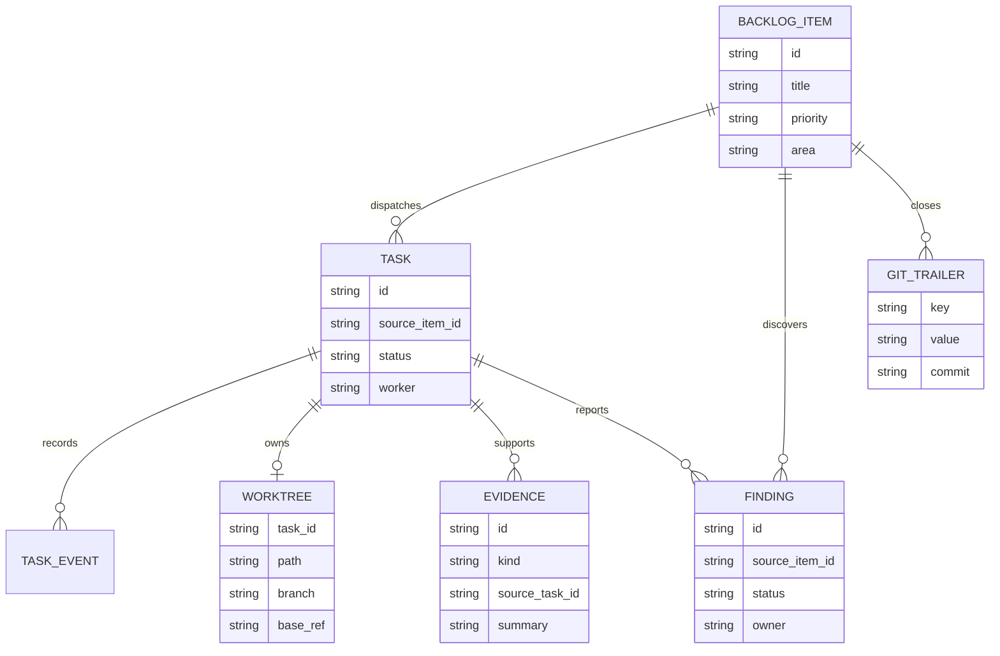
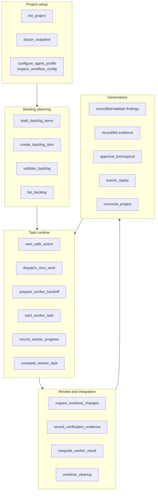
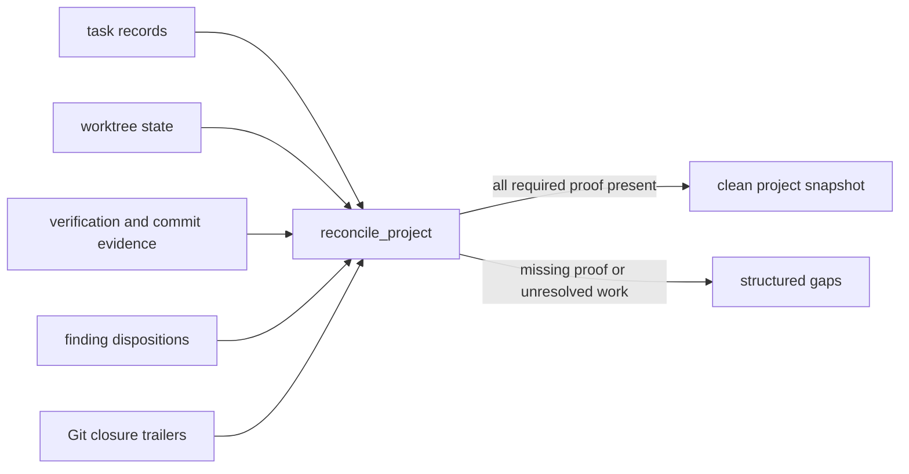
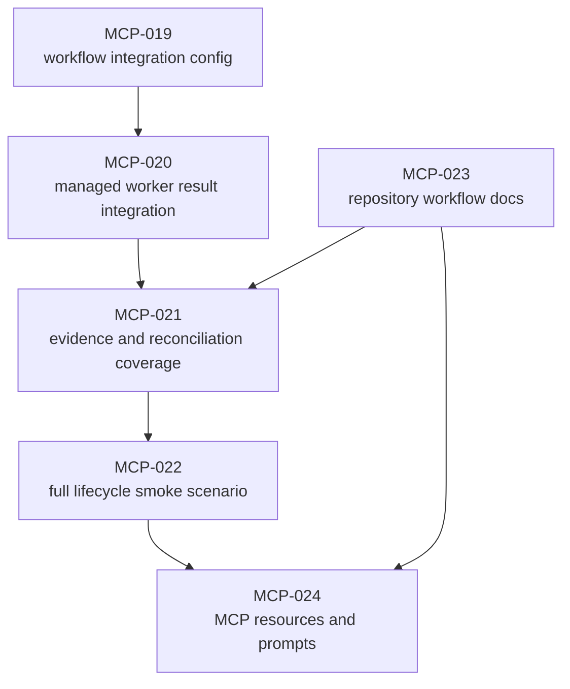

# Platypus MCP Diagrams

This document collects the main architectural and workflow diagrams from
different perspectives. Keep these diagrams aligned with the MCP tool contract
when adding new lifecycle states, durable records, or host-facing tools.

## System Boundary

Platypus is the deterministic local state boundary. MCP hosts own conversation
and model turns; Platypus owns project state transitions.

## Task State Machine

Task status is runtime state. It belongs in the local store, not in backlog
markdown.

## Host Workflow Sequence

The host should use `next_safe_action` to avoid guessing which lifecycle tool
is safe at each point.

## Integration Gates

Managed integration is intentionally strict. It should fail closed with a
structured recovery path when required evidence or workspace safety is missing.

## Durable State Model

Backlog markdown remains declarative. Runtime records are keyed from backlog
items and task ids, then reconciled against Git trailers and evidence.

## Tool Responsibility Map

Each tool group should own a narrow part of the lifecycle. New tools should fit
one of these lanes or justify a new lane.

## Reconciliation Perspective

Reconciliation is the product guardrail. It decides whether the project state
can be considered handled, independent of what a chat message claimed.

## Roadmap Dependency View

The current next work should strengthen the proof loop around the integration
path before adding richer host guidance.

