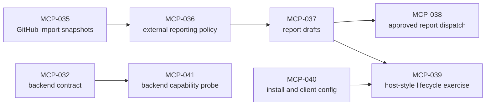

# Platypus MCP Roadmap

Platypus is moving toward a local-first MCP product boundary for autonomous
project work. Codex, Claude, and other hosts should be able to use the same
deterministic tools without depending on a custom Python gateway or UI-specific
state machine.

See [diagrams.md](diagrams.md) for repository-level diagrams that show the same
vision from boundary, state, data, tool responsibility, and reconciliation
perspectives.

## Product Vision

- MCP is the stable interface for project management tools.
- The host owns chat and model lifecycle.
- Platypus owns durable local state, backlog operations, worktree lifecycle,
  evidence, findings, approvals, and reconciliation.
- Workers run in isolated worktrees with explicit handoff bundles.
- Every important state transition is inspectable, auditable, and recoverable.

## Near-Term Direction

1. Add a provider-neutral external report draft boundary so imported GitHub or
   future tracker work can flow back toward external systems without making
   those systems the runtime source of truth.
2. Add an approval-gated external report dispatch boundary that records
   host/plugin send results without storing credentials in Platypus state.
3. Add a host-style lifecycle exercise that drives the public MCP tool surface
   from project setup through imported work, fake worker execution, evidence,
   reconciliation, and report drafting.
4. Polish installation and client configuration so Codex and Claude users can
   configure stdio MCP usage and smoke test the server without guessing.
5. Add a storage backend capability probe that runs the documented transaction,
   replay, lease, idempotency, migration, and recovery checks through the
   repository traits.

## Backlog Tranche

- `MCP-037`: draft provider-neutral external report payloads.
- `MCP-038`: add the approval-gated external report dispatch boundary.
- `MCP-039`: exercise the public MCP host lifecycle end to end with local
  fixtures.
- `MCP-040`: polish installation and Codex/Claude client configuration.
- `MCP-041`: probe the documented storage backend capability contract.

`MCP-035` and `MCP-036` established external import snapshots and reporting
policy. The next tranche turns that policy into a concrete report draft/send
boundary, then proves the whole MCP workflow can be exercised without real
agents or provider network calls.

## Design Defaults

- Strict safety by default: clean manager workspace and verification evidence
  are required before integration.
- Project-level merge policy lives in `platy.yaml` under
  `workflow.integration`.
- Backlog markdown stays declarative; closure is derived from Git trailers and
  runtime state is stored locally.
- Shell execution stays limited to explicit, audited Git and harness paths.

## Later Work

- Distribution and installation for real MCP clients.
- Better host guidance through MCP prompts/resources.
- More complete Codex and Claude adapter behavior, still behind the generic
  worker boundary.
- External intake adapters for GitHub, Linear, Jira, GitLab, and custom
  plugin-backed sources, all mapping into local executable backlog snapshots.
- The next implementation step after GitHub issue import is an approved
  external report draft/send boundary: first draft provider-neutral report
  payloads locally, then send comments/statuses only through explicit approval.
- Optional richer storage abstraction if SQL scattering becomes a maintenance
  risk.
- A second runtime backend only after the storage capability probe demonstrates
  equivalent semantics to local SQLite.
