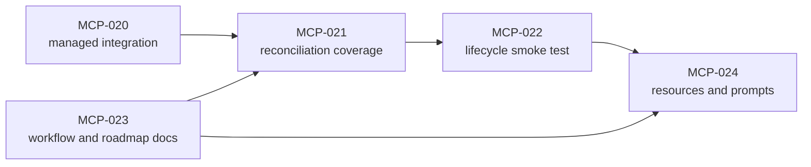

# Platypus MCP Roadmap

Platypus is moving toward a local-first MCP product boundary for autonomous
project work. Codex, Claude, and other hosts should be able to use the same
deterministic tools without depending on a custom Python gateway or UI-specific
state machine.

See [diagrams.md](diagrams.md) for repository-level diagrams that show the same
vision from boundary, state, data, tool responsibility, and reconciliation
perspectives.

## Product Vision

- MCP is the stable interface for project management tools.
- The host owns chat and model lifecycle.
- Platypus owns durable local state, backlog operations, worktree lifecycle,
  evidence, findings, approvals, and reconciliation.
- Workers run in isolated worktrees with explicit handoff bundles.
- Every important state transition is inspectable, auditable, and recoverable.

## Near-Term Direction

1. Strengthen reconciliation so completed work is not considered handled until
   verification, integration, and required findings are resolved.
2. Add full lifecycle smoke tests that use only MCP tools and fake/local
   worker fixtures.
3. Expose MCP resources or prompts so hosts can discover the recommended
   workflow without relying on external chat instructions.

## Backlog Tranche

- `MCP-021`: integration evidence and reconciliation coverage.
- `MCP-022`: full lifecycle smoke scenario.
- `MCP-024`: MCP resources and prompts for host guidance.

`MCP-020` added managed worker result integration, and `MCP-023` refreshed
these repository-level docs so future work items stay aligned with the current
tooling and intended product direction.

## Design Defaults

- Strict safety by default: clean manager workspace and verification evidence
  are required before integration.
- Project-level merge policy lives in `platy.yaml` under
  `workflow.integration`.
- Backlog markdown stays declarative; closure is derived from Git trailers and
  runtime state is stored locally.
- Shell execution stays limited to explicit, audited Git and harness paths.

## Later Work

- Distribution and installation for real MCP clients.
- Better host guidance through MCP prompts/resources.
- More complete Codex and Claude adapter behavior, still behind the generic
  worker boundary.
- External intake adapters for GitHub, Linear, Jira, GitLab, and custom
  plugin-backed sources, all mapping into local executable backlog snapshots.
- Optional richer storage abstraction if SQL scattering becomes a maintenance
  risk.
