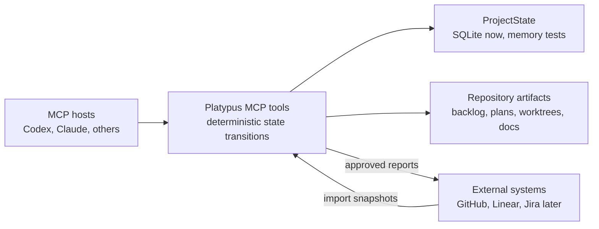

# Platypus MCP Roadmap

Platypus is moving toward a local-first MCP product boundary for autonomous
project work. Codex, Claude, and other hosts should be able to use the same
deterministic tools without depending on a custom Python gateway or UI-specific
state machine.

See [diagrams.md](diagrams.md) for repository-level diagrams that show the same
vision from boundary, state, data, tool responsibility, and reconciliation
perspectives.

## Product Vision

- MCP is the stable interface for project management tools.
- The host owns chat and model lifecycle.
- Platypus owns durable local state, backlog operations, worktree lifecycle,
  evidence, findings, approvals, and reconciliation.
- Workers run in isolated worktrees with explicit handoff bundles.
- Every important state transition is inspectable, auditable, and recoverable.

## Current Baseline

The current Rust MCP server has moved past the initial prototype tranche. The
landed baseline includes:

- declarative backlog authoring and validation
- strict task-plan YAML for non-trivial work
- durable local task, assignment, event, approval, evidence, finding, lease,
  and reconciliation state
- isolated Git worktree creation, inspection, cleanup, and managed integration
- fake-worker lifecycle smoke coverage through the public MCP protocol
- Codex, Claude, OpenCode, and Pi bootstrap helpers for stdio MCP setup
- repo-local spec-driven guidance files from `init_project`
- MCP resources and prompts for workflow, backlog authoring, worker handoff,
  integration review, recovery, and spec-driven development
- external intake and approved external report draft/dispatch boundaries
- a domain-shaped `ProjectState` boundary with SQLite and memory
  implementations under shared contract tests
- a SQL isolation guard that prevents new direct SQLite usage outside approved
  backend/migration internals
- a backlog inventory tool that explains closed, blocked, and runnable items
  without a manual queue index

After the MCP-037 through MCP-054 tranches, the repository backlog can be empty
without meaning the product is done. It means the currently committed,
reviewed work queue has been landed and the next tranche should be selected
from the product direction below.

## Candidate Next Directions

1. **Hosted protocol polish:** keep stdio as the stable baseline, then evaluate
   streamable HTTP only when a real host integration requires it.
2. **Worker handoff reliability:** make failed handoffs, retries, guidance, and
   result integration boringly recoverable across host restarts.
3. **Backlog and spec ergonomics:** improve goal-to-backlog and
   backlog-to-task-plan flows so hosts need fewer guesses when shaping work.
4. **External system adapters:** generalize GitHub import/reporting into an
   adapter boundary for Linear, Jira, GitLab, and plugin-backed sources.
5. **Second backend readiness:** use the storage capability probe and
   `ProjectState` contract tests to decide whether a shared backend such as
   Postgres is justified.
6. **Release and installation hardening:** keep crates.io, GitHub releases,
   bootstrap diagnostics, and host smoke tests simple enough for fresh installs.

## Current Planning Rule

Do not keep a manual queue index. Use `inspect_work_queue` for executable work
and `inspect_backlog_inventory` when the queue is empty or confusing. New
tranches should be added as small, reviewable backlog items with task plans for
standard or full work.

## Design Defaults

- Strict safety by default: clean manager workspace and verification evidence
  are required before integration.
- Project-level merge policy lives in `platy.yaml` under
  `workflow.integration`.
- Backlog markdown stays declarative; closure is derived from Git trailers and
  runtime state is stored locally.
- Shell execution stays limited to explicit, audited Git and harness paths.

## Later Work

- First-class host smoke tests for each supported bootstrap target.
- Richer MCP guidance resources if hosts start consuming them consistently.
- External intake adapters for Linear, Jira, GitLab, and custom plugin-backed
  sources, all mapping provider records into local executable backlog snapshots
  and approved report outcomes before any provider-side mutation is recorded.
- A second runtime backend only after the storage capability probe and
  `ProjectState` contract suite demonstrate equivalent semantics to local
  SQLite.
- Optional HTTP transport once stdio behavior is mature and an actual client
  needs attachable or remote transport semantics.
