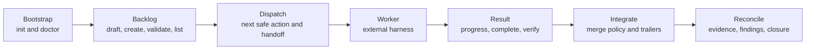

# MCP Tool Contract

Platypus tools return typed JSON with a shared envelope:

- `action`: stable tool action name
- `status`: `completed`, `skipped`, or `failed`
- `summary`: concise human-readable result
- `next_action`: optional recovery or continuation instruction
- `data`: typed result payload
- `error`: optional failure detail

Hosts should prefer `inspect_work_queue` when choosing runnable backlog work,
`classify_planning_needs` when explaining whether design/task planning is
required, and `next_safe_action` when deciding the next lifecycle command. The
lower-level tools remain available for precise control and testing.

## Host Guidance Resources And Prompts

Before using lifecycle tools, MCP hosts should list resources/prompts and read
the Platypus guidance that matches the current activity. The guidance is
deterministic and references the current public tool names.

- Resource `platypus://guidance/workflow` / prompt `platypus-workflow`
- Resource `platypus://guidance/project-status` / prompt
  `platypus-project-status`
- Resource `platypus://guidance/backlog-authoring` / prompt
  `platypus-backlog-authoring`
- Resource `platypus://guidance/worker-handoff` / prompt
  `platypus-worker-handoff`
- Resource `platypus://guidance/integration-review` / prompt
  `platypus-integration-review`
- Resource `platypus://guidance/recovery` / prompt `platypus-recovery`

## Recommended Host Flow

1. Bootstrap and inspect: `init_project`, `doctor_snapshot`,
   `inspect_status`, `inspect_workflow_config`.
2. Shape backlog: `draft_backlog_items`, `draft_external_backlog_items`,
   `import_github_issues`, `create_backlog_item`, `validate_backlog`,
   `list_backlog`.
3. Plan non-trivial work: `draft_task_plan`, `write_task_plan`,
   `validate_task_plan`, `inspect_task_plan`, `list_task_plans`.
4. Inspect the executable queue: `inspect_work_queue`.
5. Dispatch work: `next_safe_action`, `dispatch_next_work`,
   `prepare_worker_handoff`.
6. Run worker externally: pass the generated bundle/worktree to Codex, Claude,
   or another harness.
7. Record worker activity: `start_worker_task`, `record_worker_progress`,
   `complete_worker_task`.
8. Inspect and verify: `inspect_worktree_changes`,
   `record_verification_evidence`, `record_finding`, `validate_findings`.
9. Integrate and clean up: `integrate_worker_result`, `reconcile_project`,
   `worktree_cleanup`.



## Tool Groups

### Project And Configuration

- `ping`: health check.
- `init_project`: create missing project scaffold files.
- `doctor_snapshot`: inspect setup issues and recovery guidance.
- `inspect_status` / `project_status`: inspect project shape and runnable work.
- `inspect_workflow_config`: inspect effective workflow integration defaults.
- `list_agent_profiles`: list configured manager and worker profiles.
- `configure_agent_profile`: create or update one agent profile.

## Local Tool Smoke Helper

For development, the binary can invoke one MCP tool through its own stdio
server and print the structured result as formatted JSON:

```bash
cargo run -- tool --root "$PWD" inspect_work_queue '{"limit":5}'
```

The helper exits non-zero when the MCP tool returns a failed structured result
or when the protocol call itself fails. It is intended for local smoke testing
and scripts; MCP hosts should still call tools through MCP directly.

### Backlog

- `draft_backlog_items`: draft deterministic candidate backlog items from a
  goal.
- `draft_external_backlog_items`: draft provider-neutral candidates from
  host-provided external work records and skip already-imported references.
- `import_github_issues`: import host-provided GitHub issue records as local
  backlog snapshots. The first implementation does not call GitHub directly;
  the MCP host supplies issue JSON from its approved GitHub integration.
- `create_backlog_item`: write one structured backlog item.
- `validate_backlog`: validate backlog item and epic files.
- `list_backlog`: list runnable backlog candidates.

Backlog item frontmatter may include provider-neutral `external_refs`. Use them
to preserve where work came from or where results should be reported without
making an external tracker the execution contract.

External intake adapters should map provider-specific records into the same
draft shape before creating local backlog items. The local backlog item remains
the stable executable snapshot.

#### External Reporting And Sync Policy

Platypus should treat external trackers as integration surfaces, not hidden
runtime state. Supported policy modes:

- **Import-only:** external records are copied into local backlog snapshots.
  Execution, closure, evidence, and findings stay local. This is the
  recommended first product mode and is what `import_github_issues` implements.
- **Import plus explicit reporting:** local execution remains canonical, but a
  future approved tool may post a summary, PR link, verification result, or
  follow-up finding back to the external record.
- **Mirror:** selected local state is reflected into external fields or labels.
  This needs drift detection and conflict handling before it is safe.
- **Bidirectional sync:** external edits can update local backlog snapshots.
  This is high-risk and requires provider-specific merge policy, audit, and
  user approval.
- **External-source mode:** the tracker is treated as the source of backlog
  truth. This is intentionally not the default because it makes local Git
  history and MCP runtime state harder to reason about.

Safe automation:

- read/import host-approved external records
- draft local backlog snapshots
- detect duplicate external refs and source-hash drift
- draft external report payloads without sending them

Approval-required actions:

- posting issue comments, PR links, labels, statuses, or closure updates
- mutating external issue fields
- resolving conflicts where external and local state disagree
- enabling bidirectional sync or external-source mode

Security rules for future provider tools:

- credentials stay in the MCP host or an approved secret store, never in backlog
  frontmatter, task plans, evidence, events, or Git commits
- tool output must redact tokens, cookies, private headers, and provider error
  payloads that may contain secrets
- provider rate limits and outages return structured skipped/failed results
  with retry guidance
- plugin-backed providers must map through the provider-neutral external record
  and external ref schemas before creating or updating local backlog items

### Task Plans

- `draft_task_plan`: draft a strict plan for one backlog item without writing
  it.
- `write_task_plan`: write one reviewable plan to `backlog/plans/<ITEM>.yaml`.
- `validate_task_plan`: validate strict plan YAML, task IDs, dependencies,
  requirement references, owned surfaces, verification, and acceptance.
- `inspect_task_plan`: read one committed task plan.
- `list_task_plans`: list committed task plans.

Task plan YAML is planned work only. It must not contain runtime status,
completion commits, attempts, evidence, or worker diary fields. Runtime state
belongs in `.platy/platypus.sqlite3`, evidence records, task events, and Git
trailers.

### Task And Workspace Lifecycle

- `next_safe_action`: recommend the next safe tool call and parameters.
- `inspect_work_queue`: inspect runnable backlog candidates with task-plan
  state and a recommended next tool.
- `classify_planning_needs`: classify runnable items as `direct`, `standard`,
  or `full` planning mode with structured reasons.
- `dispatch_next_work`: create a queued task from the next runnable backlog
  item.
- `inspect_task`: inspect one task lifecycle record.
- `claim_next_task`: atomically claim a queued task.
- `worktree_create`: create an isolated task worktree.
- `worktree_status`: inspect recorded worktree metadata.
- `worktree_diff` / `inspect_worktree_changes`: inspect bounded worktree
  changes.
- `worktree_cleanup`: remove a clean or explicitly forced task worktree.
- `integrate_worker_result`: merge, fast-forward, or squash a completed
  verified task branch into the manager workspace.
- `generate_task_bundle`: generate a deterministic worker brief.
- `runner_prepare_next`: claim queued tasks and prepare worktrees/bundles.

### Worker Handoff And Results

- `prepare_worker_assignment` / `prepare_worker_handoff`: persist a worker
  handoff object.
- `inspect_worker_assignment`: inspect a persisted worker assignment.
- `start_worker_execution` / `start_worker_task`: mark a prepared assignment as
  running.
- `record_worker_event` / `record_worker_progress`: persist worker progress.
- `complete_worker_execution` / `complete_worker_task`: finish a worker task
  with result, changed files, and verification status.
- `send_worker_guidance`: persist steering messages for active tasks.

### Supervision, Evidence, And Findings

- `approval_list` / `approval_respond`: inspect and resolve durable approval
  requests.
- `events_replay`: replay bounded project/task/approval/worker events.
- `inspect_task_events`: replay task-scoped events.
- `record_evidence` / `record_verification_evidence`: persist audit evidence.
- `list_evidence`: inspect evidence records.
- `reconcile_project`: report required gaps across tasks, findings, evidence,
  and closure trailers.
- `record_finding`: persist a follow-up finding.
- `list_findings`: list stored findings.
- `validate_findings`: fail when required findings remain unresolved.
- `update_finding_disposition`: resolve, reject, defer, or assign findings.

## Example: Guided Dispatch

```json
{
  "tool": "next_safe_action",
  "arguments": {}
}
```

When a backlog item is runnable, the result recommends `dispatch_next_work`.
After dispatch, the same tool recommends `prepare_worker_handoff`, then
`start_worker_task`, then `record_worker_progress` while the assignment is
running.

## Workflow Configuration

New projects include:

```yaml
workflow:
  integration:
    merge_style: merge_commit
    require_clean_manager_workspace: true
    require_verification_evidence: true
```

Current valid merge styles are `merge_commit`, `fast_forward`, and `squash`.
`integrate_worker_result` uses this policy when bringing completed worker
branches back into the manager workspace.
