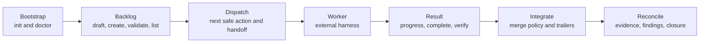

# MCP Tool Contract

Platypus tools return typed JSON with a shared envelope:

- `action`: stable tool action name
- `status`: `completed`, `skipped`, or `failed`
- `summary`: concise human-readable result
- `next_action`: optional recovery or continuation instruction
- `data`: typed result payload
- `error`: optional failure detail

Hosts should prefer `next_safe_action` when deciding what to do next. The
lower-level tools remain available for precise control and testing.

## Host Guidance Resources And Prompts

Before using lifecycle tools, MCP hosts should list resources/prompts and read
the Platypus guidance that matches the current activity. The guidance is
deterministic and references the current public tool names.

- Resource `platypus://guidance/workflow` / prompt `platypus-workflow`
- Resource `platypus://guidance/project-status` / prompt
  `platypus-project-status`
- Resource `platypus://guidance/backlog-authoring` / prompt
  `platypus-backlog-authoring`
- Resource `platypus://guidance/worker-handoff` / prompt
  `platypus-worker-handoff`
- Resource `platypus://guidance/integration-review` / prompt
  `platypus-integration-review`
- Resource `platypus://guidance/recovery` / prompt `platypus-recovery`

## Recommended Host Flow

1. Bootstrap and inspect: `init_project`, `doctor_snapshot`,
   `inspect_status`, `inspect_workflow_config`.
2. Shape backlog: `draft_backlog_items`, `create_backlog_item`,
   `validate_backlog`, `list_backlog`.
3. Dispatch work: `next_safe_action`, `dispatch_next_work`,
   `prepare_worker_handoff`.
4. Run worker externally: pass the generated bundle/worktree to Codex, Claude,
   or another harness.
5. Record worker activity: `start_worker_task`, `record_worker_progress`,
   `complete_worker_task`.
6. Inspect and verify: `inspect_worktree_changes`,
   `record_verification_evidence`, `record_finding`, `validate_findings`.
7. Integrate and clean up: `integrate_worker_result`, `reconcile_project`,
   `worktree_cleanup`.



## Tool Groups

### Project And Configuration

- `ping`: health check.
- `init_project`: create missing project scaffold files.
- `doctor_snapshot`: inspect setup issues and recovery guidance.
- `inspect_status` / `project_status`: inspect project shape and runnable work.
- `inspect_workflow_config`: inspect effective workflow integration defaults.
- `list_agent_profiles`: list configured manager and worker profiles.
- `configure_agent_profile`: create or update one agent profile.

### Backlog

- `draft_backlog_items`: draft deterministic candidate backlog items from a
  goal.
- `create_backlog_item`: write one structured backlog item.
- `validate_backlog`: validate backlog item and epic files.
- `list_backlog`: list runnable backlog candidates.

### Task And Workspace Lifecycle

- `next_safe_action`: recommend the next safe tool call and parameters.
- `dispatch_next_work`: create a queued task from the next runnable backlog
  item.
- `inspect_task`: inspect one task lifecycle record.
- `claim_next_task`: atomically claim a queued task.
- `worktree_create`: create an isolated task worktree.
- `worktree_status`: inspect recorded worktree metadata.
- `worktree_diff` / `inspect_worktree_changes`: inspect bounded worktree
  changes.
- `worktree_cleanup`: remove a clean or explicitly forced task worktree.
- `integrate_worker_result`: merge, fast-forward, or squash a completed
  verified task branch into the manager workspace.
- `generate_task_bundle`: generate a deterministic worker brief.
- `runner_prepare_next`: claim queued tasks and prepare worktrees/bundles.

### Worker Handoff And Results

- `prepare_worker_assignment` / `prepare_worker_handoff`: persist a worker
  handoff object.
- `inspect_worker_assignment`: inspect a persisted worker assignment.
- `start_worker_execution` / `start_worker_task`: mark a prepared assignment as
  running.
- `record_worker_event` / `record_worker_progress`: persist worker progress.
- `complete_worker_execution` / `complete_worker_task`: finish a worker task
  with result, changed files, and verification status.
- `send_worker_guidance`: persist steering messages for active tasks.

### Supervision, Evidence, And Findings

- `approval_list` / `approval_respond`: inspect and resolve durable approval
  requests.
- `events_replay`: replay bounded project/task/approval/worker events.
- `inspect_task_events`: replay task-scoped events.
- `record_evidence` / `record_verification_evidence`: persist audit evidence.
- `list_evidence`: inspect evidence records.
- `reconcile_project`: report required gaps across tasks, findings, evidence,
  and closure trailers.
- `record_finding`: persist a follow-up finding.
- `list_findings`: list stored findings.
- `validate_findings`: fail when required findings remain unresolved.
- `update_finding_disposition`: resolve, reject, defer, or assign findings.

## Example: Guided Dispatch

```json
{
  "tool": "next_safe_action",
  "arguments": {}
}
```

When a backlog item is runnable, the result recommends `dispatch_next_work`.
After dispatch, the same tool recommends `prepare_worker_handoff`, then
`start_worker_task`, then `record_worker_progress` while the assignment is
running.

## Workflow Configuration

New projects include:

```yaml
workflow:
  integration:
    merge_style: merge_commit
    require_clean_manager_workspace: true
    require_verification_evidence: true
```

Current valid merge styles are `merge_commit`, `fast_forward`, and `squash`.
`integrate_worker_result` uses this policy when bringing completed worker
branches back into the manager workspace.
