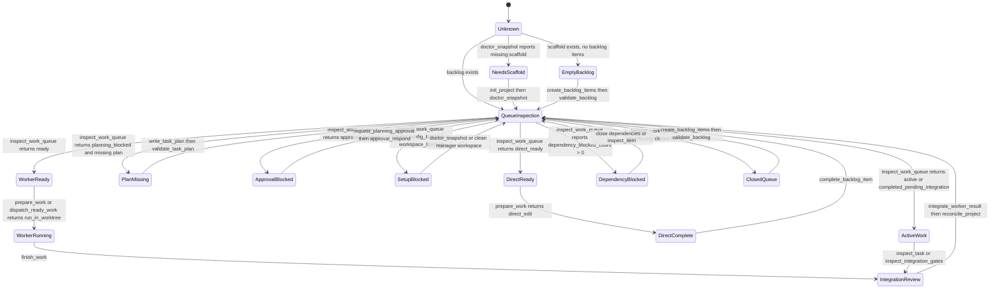

# Current MCP Workflow

This document describes how a host such as Codex or Claude should use the
current Platypus MCP tools. The MCP server owns deterministic project state
transitions; the host owns conversation, model turns, and any external worker
execution.

See [diagrams.md](diagrams.md) for state, data, responsibility, and roadmap
diagrams from additional perspectives.

## Host Guidance Resources

MCP hosts should list resources and prompts during setup and cache the guidance
for the active session. The server exposes the same deterministic guidance as
both readable resources and prompts so clients can choose the integration style
that fits their UI.

Resources:

- `platypus://guidance/workflow`: end-to-end host workflow and safety gates.
- `platypus://guidance/spec-driven-development`: goal intake, backlog
  shaping, task planning, dispatch, evidence, and integration loop.
- `platypus://guidance/project-status`: project inspection and setup blockers.
- `platypus://guidance/tool-preload`: optional planning and execution startup
  tool groups for hosts that defer tool schemas.
- `platypus://guidance/backlog-authoring`: declarative backlog authoring rules.
- `platypus://guidance/worker-handoff`: worker dispatch, handoff, progress, and
  completion flow.
- `platypus://guidance/integration-review`: review and integration gates.
- `platypus://guidance/recovery`: inspection and recovery commands.

Equivalent prompts are available as `platypus-workflow`,
`platypus-spec-driven-development`, `platypus-project-status`,
`platypus-tool-preload`, `platypus-backlog-authoring`, `platypus-worker-handoff`,
`platypus-integration-review`, and `platypus-recovery`.

Tool preloading is optional and host-specific. Hosts that support deferred
schema preloading should read `platypus-tool-preload` at session start, load
the planning group for backlog/design/status work, and load the execution group
before dispatch, worker handoff, verification, integration, or recovery. Hosts
without preloading support should use the same tools normally as the workflow
requires them.

## Principles

- Start with `doctor_snapshot` or `inspect_status` when the project state is
  unclear.
- Prefer `inspect_queue_status` for quick queue triage and `inspect_work_queue`
  for executable backlog selection and lifecycle routing instead of guessing
  the next command.
- Keep backlog markdown declarative; runtime state belongs in
  `.platy/platypus.sqlite3`.
- Treat worker worktrees as isolated execution spaces until reviewed and
  integrated.
- Record findings and verification evidence instead of hiding limitations in
  chat.

## Workflow State Machine

Use this state machine when deciding the next tool. The MCP server supplies
facts and deterministic transitions; the host model supplies product judgment
and concrete content.

| State | How to identify it | Required next action |
| --- | --- | --- |
| Unknown | Session start or stale chat context | `inspect_session` |
| Needs scaffold | `doctor_snapshot` reports missing project files | `init_project`, then rerun `doctor_snapshot` |
| Empty backlog | `inspect_work_queue` reports no items | Host decides concrete items, then `create_backlog_items` and `validate_backlog` |
| Dependency blocked | `inspect_work_queue.inventory.dependency_blocked_count > 0` | `inspect_item` on the blocked item; close or create its dependencies |
| Plan missing | `inspect_work_queue.items[].recommended_tool == "write_task_plan"` | Host writes exact plan with `write_task_plan`, then `validate_task_plan` |
| Approval blocked | `queue_state == "approval_blocked"` | `request_planning_approval`, then `approval_respond` |
| Config blocked | `queue_state == "config_blocked"` | `doctor_snapshot` and the reported recovery action |
| Workspace blocked | `queue_state == "workspace_blocked"` | Commit, stash, or finish the manager-workspace change before worker dispatch |
| Direct ready | `queue_state == "direct_ready"` | `prepare_work`, edit manager workspace, `complete_backlog_item` |
| Worker ready | `queue_state == "ready"` | `prepare_work` for one item or `dispatch_ready_work` for batch handoff |
| Active work | `queue_state == "active"` or existing task id | `inspect_task`, `inspect_task_events`, `finish_work`, or recovery action |
| Pending integration | `queue_state == "completed_pending_integration"` | `inspect_integration_gates`, then `integrate_worker_result` |
| Closed queue | only closed items remain | Host decides whether to create more work; if yes, `create_backlog_items` |

### Lifecycle Output States

Queue tools emit exactly these queue states:

| Queue state | Meaning | Follow-up |
| --- | --- | --- |
| `direct_ready` | direct manager-workspace work is executable | `prepare_work`, edit, `complete_backlog_item` |
| `ready` | worker handoff can be prepared | `prepare_work` or `dispatch_ready_work` |
| `planning_blocked` | a required task plan is missing or invalid | `write_task_plan`, then `validate_task_plan` |
| `approval_blocked` | planning approval is required before execution | `request_planning_approval`, then `approval_respond` |
| `dependency_blocked` | backlog dependencies are still open | `inspect_item` and close or create the dependencies |
| `config_blocked` | project setup blocks worktree dispatch | `doctor_snapshot` and the reported recovery action |
| `workspace_blocked` | manager workspace changes block worker dispatch | commit, stash, or finish those changes |
| `active` | a task lifecycle already exists | `inspect_task`, `inspect_task_events`, or the recommended active-task tool |
| `completed_pending_integration` | worker output is complete and awaiting integration | `inspect_integration_gates`, then `integrate_worker_result` |

`prepare_work.prepared_state` is `direct_guidance`, `worktree_prepared`, or
`not_prepared`. `direct_guidance` is response-local: it creates no task,
assignment, event, or worktree, so `complete_backlog_item` is the next durable
transition. `worktree_prepared` means a worker assignment and worktree were
persisted. `not_prepared` means no selected item could be prepared and the host
should follow `next_action`.

Host action kinds are `direct_edit`, `run_in_worktree`,
`verify_or_record_risk`, `resolve_findings`, `integrate_result`,
`inspect_or_recover`, and `done`. Treat them as the exact next-step contract
returned by `prepare_work`, `finish_work`, or completion tools.

## Bootstrap

1. For a fresh project, run `platypus-mcp bootstrap <host> --root <project>
   --init-project` so host MCP configuration and repository guidance files are
   created in one step.
2. For an already initialized project, run `bootstrap <host>` for host config
   only, or call `init_project` from the MCP host if scaffold files are
   missing.
3. Run `doctor_snapshot` to check config, backlog directories, Git metadata,
   and recovery guidance.
4. Inspect workflow policy with `inspect_workflow_config`.

At the start of an MCP-host session, `inspect_session` can replace the separate
startup detector calls to `doctor_snapshot`, `inspect_status`,
`inspect_workflow_config`, `inspect_queue_status`, and `inspect_work_queue`
when it succeeds and the snapshot is fresh. Call the narrower tools after
mutations, when the host needs a detailed payload, or when a previous chat
turn may be stale.

`init_project` also installs project-local agent and workflow guidance. That is
intentional: once an MCP host enters an initialized directory, normal goal
requests should naturally flow through Platypus instead of ad hoc edits.
The transparent steering layer is deliberately layered: MCP server
instructions/resources/prompts are the stable contract, `AGENTS.md` provides
generic agent guidance, and `CLAUDE.md` provides Claude Code guidance. Other
host-specific files should be added only after their local instruction
mechanism is verified.

## Backlog Shaping

1. Decide workflow strategy with the host model and user intent. Platypus MCP
   exposes facts, schemas, validation, and state transitions; it does not infer
   product intent from goal text.
2. Persist selected work with `create_backlog_items` when related items should
   be created atomically, or `create_backlog_item` for a single item.
3. Use `update_backlog_item` for typed corrections or refinements after an item
   exists. Do this instead of hand-editing markdown when the change is a
   supported schema or section update.
4. Run `validate_backlog`. Its `next_action` follows explicit execution
   policy: direct-ready queues continue through `prepare_work` and
   `complete_backlog_item`; worker-handoff queues still recommend committing
   planning artifacts before worktree dispatch when needed.
5. Use `inspect_queue_status` for compact queue counts, top ready work, top
   blocked work, active tasks, and one-line queue-state descriptions.
6. Use `inspect_work_queue` when the host needs full runnable candidates,
   active task state, dependency-blocked items, closed items, task-plan state,
   setup blockers, and recommended tool parameters.
7. Use `inspect_item` when one backlog item needs full state: markdown
   sections, dependencies, closure state, task plan, findings, evidence, and
   the recommended next tool.
8. Use `list_backlog` only when a compact runnable-candidate list is enough.
   Use `queue_state` as the authoritative routing signal: `direct_ready` means
   the host can proceed through `prepare_work` and complete with
   `complete_backlog_item`; `ready` means worker/worktree preparation is
   possible; blocked states identify the specific recovery path.

Validation does not make planning commits mandatory for direct work. Direct
items can continue through `prepare_work` and complete with
`complete_backlog_item`; commit first only when the host wants a checkpoint.
Worker-handoff items need committed planning context before creating worktrees.
Use `commit_planning_artifacts` when backlog or task-plan files are the only
pending manager-workspace changes.

Minimum viable direct-edit loop for tiny, user-approved work:
`inspect_session`, `inspect_queue_status` or `inspect_work_queue`,
`prepare_work`, edit the manager workspace, run relevant verification, then
`complete_backlog_item`. This is a traceability tradeoff: it avoids worktree
overhead for small tasks while still recording the durable completion. Use task
plans, worker handoff, findings, and integration gates for long-lived,
parallel, or review-sensitive product development.

Backlog files should contain goal, implementation contract, acceptance
criteria, dependencies, and owned surfaces. They should not contain runtime
status, task attempts, PR metadata, or closure state.

When creating backlog items through tools, use the typed schema:

- minimal input: a meaningful `goal` or `title`; Platypus derives conservative
  defaults for missing title, goal, implementation contract, and first
  acceptance criterion
- rich input: explicit `title`, `goal`, `implementation_contract` or
  `contract`, and `acceptance` criteria when the work is complex or generated
  defaults would be too broad
- priority values: `P0`, `P1`, `P2`
- type values: `foundation`, `feature`, `safety`, `ux`, `test`, `docs`
- default values when omitted: priority `P1`, type `feature`, epic `general`
- Worker selection is runtime state. The manager or MCP host chooses the
  executor when preparing execution; Platypus does not create or configure
  agents.
- failed authoring calls include a specific `recovery_action`; follow it before
  retrying instead of falling back to manual markdown unless the recovery
  explicitly asks for a file edit
- use `list_epics` before assigning a non-default epic, and `create_epic` when
  a new grouping is needed
- use `client_key` plus `depends_on_keys` in `create_backlog_items` for
  dependencies between newly created items; the tool resolves those keys to
  concrete backlog IDs before writing files
- use `update_backlog_item` for supported changes to existing items; it
  validates the full backlog after writing and restores the previous item when
  validation fails
- closed items are protected from update by default; create a follow-up item
  unless the correction is intentional and `force_closed=true` is justified

Backlog items may include `external_refs` for intake and reporting surfaces
such as GitHub, Linear, Jira, GitLab, support tickets, specs, or local design
documents. These references are metadata only: the local backlog item remains
the executable snapshot for planning and dispatch. Each reference records a
provider, kind, stable id, and either a URL or locator, with optional import
timestamp and source hash.

## External Reporting

External trackers are never mutated implicitly. When a backlog item carries an
external reference, use:

1. `draft_external_report` to create a provider-neutral report from local
   backlog, task, and evidence state.
2. `request_external_report_approval` to make the intended external mutation
   explicit and durable.
3. Have the MCP host or approved provider plugin send the report after approval.
4. `record_external_report_dispatch` to record the send result, outbound
   reference, provider error if any, and external-report evidence.

This keeps provider credentials outside Platypus state while preserving an
auditable local record of what was approved and reported.

## Task Planning

Use `inspect_work_queue` to inspect task-plan state and setup blockers. The
MCP server does not infer whether an item is small or architecture-sensitive
from its title. Execution policy is durable and explicit:

- Project defaults live in `platy.yaml` under `workflow.execution`.
- Item overrides live in backlog item frontmatter as `execution_path` and
  `planning_gate`.
- `execution_path=direct_edit` means the host edits the manager workspace and
  finishes with `complete_backlog_item`.
- `execution_path=worker_handoff` means Platypus prepares an isolated worktree
  handoff for an external harness.
- `planning_gate=none` requires no task plan.
- `planning_gate=task_plan` requires a valid `backlog/plans/<ITEM>.yaml`.
- `planning_gate=approved_task_plan` requires a valid task plan and an approved
  planning approval record.

The legacy queue inputs `require_task_plan` and `require_planning_approval` are
compatibility hints only. They do not choose direct vs worker mode.

Task plans are strict YAML artifacts. They may contain requirements, a design
summary, owned surfaces, verification commands, and executable planned tasks.
They must not contain runtime fields such as status, completed_at, commit,
attempts, result, evidence, or worker diary comments. Use `inspect_task_plan`
and `list_task_plans` to review committed plans.

For review-sensitive work, request planning approval before dispatch:

1. Call `request_planning_approval` with one `item_id` for a task plan, or
   multiple `item_ids` for a backlog tranche.
2. Respond with `approval_respond`.
3. Set `planning_gate=approved_task_plan` on the relevant backlog item or
   workflow default.
4. Call `inspect_work_queue` or `dispatch_ready_work`.

Planning approval records live in local approval state, not backlog item
frontmatter. `reconcile_project` reports planned task lifecycles that were
created without an approved planning gate.

## Dispatch And Worker Handoff

1. Call `inspect_work_queue`.
2. If it requires a task plan, use the recommended task-plan tool first.
3. If policy requires reviewed planning, call `request_planning_approval`,
   approve it, and retry the queue or dispatch tool.
4. Use the `recommended_tool`, `reason`, and `params` from `inspect_work_queue`
   to choose the next lifecycle command.
5. Execution is host-managed. `manual_handoff` prepares the task, assignment,
   worktree, and bundle for the MCP host or a human-managed worker. `auto`
   resolves to the same host-managed handoff path.
6. For normal execution, call `prepare_work`; it either returns `direct_edit`
   guidance or prepares an assignment, worktree, and bundle for host-run worker
   execution. Direct work creates no task, assignment, worktree, or durable
   prepared marker; `complete_backlog_item` is the next persisted transition.
7. For lower-level batch dispatch, call `dispatch_ready_work`; it only accepts
   items whose effective policy is `execution_path=worker_handoff` and whose
   planning gates are satisfied. It dispatches one or more runnable worker
   items and prepares assignments, worktrees, and bundles. Pass
   `execution_mode=manual_handoff` when you want to be explicit about the
   host-managed handoff path.
8. For low-level debugging only, call `dispatch_next_work` and then immediately
   `prepare_worker_handoff`; do not run a worker from a bare task id.
9. Give the assignment bundle, completion contract, and worktree path to the worker harness.
10. Mark the worker active with `start_worker_task` when you need an explicit
   running transition.

For direct work, edit the manager workspace and finish with
`complete_backlog_item`. The `prepare_work` direct action is response-local
guidance, so queue inspection continues to show `direct_ready` until completion
is recorded. `complete_backlog_item` records direct completion evidence, a
backlog event, and optionally a closure commit for explicit changed files. For
worker work, the worker should operate in the assigned worktree, not in the
manager workspace.
Manual handoff is still lifecycle-tracked: after the host or external worker
edits the worktree, call `start_worker_task` if a running transition is needed,
then `finish_work`. Follow its `host_action` to verify, record or resolve
findings, integrate, recover, or continue to the next item.

## Worker Progress And Result

Use `record_worker_progress` for safe progress summaries. Use
`inspect_worktree_changes` to review bounded worktree changes. Worker
assignments finish with `finish_work`, including:

- terminal status
- summary
- changed files
- verification status
- findings or `findings_reviewed=true`

For same-session host-driven edits, `finish_work` can complete a
prepared assignment directly; it auto-starts prepared assignments by default.
Set `auto_start_if_prepared=false` when strict lifecycle enforcement is needed.
For direct manager-workspace edits returned by `prepare_work`, do not call
`finish_work`; no direct task or assignment exists. Call `complete_backlog_item`
with item id, summary, changed files, verification status, and any evidence or
finding references.
Use `inspect_integration_gates` before integration when the host needs a
read-only explanation of remaining blockers. Required findings block only while
they are open; `accepted`, `deferred`, `resolved`, `rejected`, and `duplicate`
are explicit dispositions that clear the integration gate.

When a verification command is configured in the assignment bundle, run
`run_task_verification` after completion to execute it in the task worktree and
persist verification run evidence.

If verification did not pass, record explicit verification evidence or findings
so reconciliation can report the remaining gap.

## Evidence, Findings, And Reconciliation

- Use `record_verification_evidence` for verification results.
- Use `record_finding` for limitations or required follow-up work.
- Use `complete_backlog_item` to close direct manager-workspace work.
- Use `validate_findings` before claiming a task is handled.
- Use `integrate_worker_result` to bring a completed verified worktree back
  into the manager workspace according to `workflow.integration`.
- Use `reconcile_project` to find missing verification evidence, open findings,
  closure gaps, and evidence attached to missing or incomplete task
  lifecycles.

## Managed Integration

Managed integration from task worktree back into the manager workspace is
handled by `integrate_worker_result`. The tool requires a completed task, a
recorded worktree, a clean manager workspace, and verification evidence by
default.

The tool uses `workflow.integration.merge_style` from `platy.yaml` and creates
closure commits with `Platypus-Closes` and `Platypus-Verification` trailers.
If integration cannot proceed, the tool returns structured recovery guidance.
