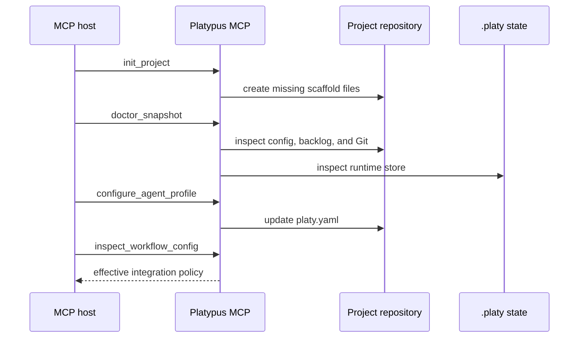
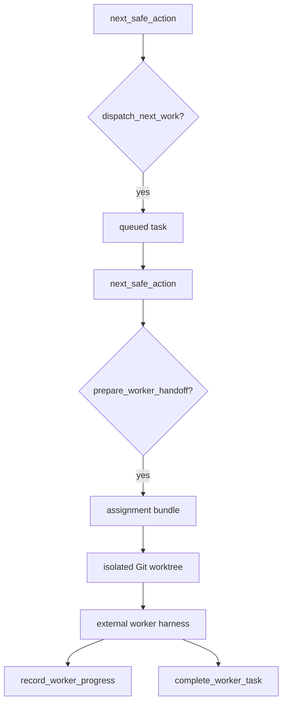

# Current MCP Workflow

This document describes how a host such as Codex or Claude should use the
current Platypus MCP tools. The MCP server owns deterministic project state
transitions; the host owns conversation, model turns, and any external worker
execution.

See [diagrams.md](diagrams.md) for state, data, responsibility, and roadmap
diagrams from additional perspectives.

## Principles

- Start with `doctor_snapshot` or `inspect_status` when the project state is
  unclear.
- Prefer `next_safe_action` over guessing the next lifecycle command.
- Keep backlog markdown declarative; runtime state belongs in
  `.platy/platypus.sqlite3`.
- Treat worker worktrees as isolated execution spaces until reviewed and
  integrated.
- Record findings and verification evidence instead of hiding limitations in
  chat.

## Bootstrap

1. Run `init_project` for missing scaffold files.
2. Run `doctor_snapshot` to check config, backlog directories, Git metadata,
   and recovery guidance.
3. Configure manager and worker profiles with `configure_agent_profile`.
4. Inspect workflow policy with `inspect_workflow_config`.



## Backlog Shaping

1. Use `draft_backlog_items` for a deterministic first pass from a goal.
2. Persist selected work with `create_backlog_item`.
3. Run `validate_backlog`.
4. Use `list_backlog` to see runnable candidates.

Backlog files should contain goal, implementation contract, acceptance
criteria, dependencies, and owned surfaces. They should not contain runtime
status, task attempts, PR metadata, or closure state.

## Dispatch And Worker Handoff

1. Call `next_safe_action`.
2. If it recommends `dispatch_next_work`, dispatch the next runnable item.
3. Call `next_safe_action` again.
4. If it recommends `prepare_worker_handoff`, prepare the persisted assignment.
5. Give the assignment bundle and worktree path to the worker harness.
6. Mark the worker active with `start_worker_task`.

The worker should operate in the assigned worktree, not in the manager
workspace.



## Worker Progress And Result

Use `record_worker_progress` for safe progress summaries. Use
`inspect_worktree_changes` to review bounded worktree changes. Finish with
`complete_worker_task`, including:

- terminal status
- summary
- changed files
- verification status

If verification did not pass, record explicit verification evidence or findings
so reconciliation can report the remaining gap.

## Evidence, Findings, And Reconciliation

- Use `record_verification_evidence` for verification results.
- Use `record_finding` for limitations or required follow-up work.
- Use `validate_findings` before claiming a task is handled.
- Use `integrate_worker_result` to bring a completed verified worktree back
  into the manager workspace according to `workflow.integration`.
- Use `reconcile_project` to find missing verification evidence, unresolved
  findings, and closure gaps.

## Managed Integration

Managed integration from task worktree back into the manager workspace is
handled by `integrate_worker_result`. The tool requires a completed task, a
recorded worktree, a clean manager workspace, and verification evidence by
default.

The tool uses `workflow.integration.merge_style` from `platy.yaml` and creates
closure commits with `Platypus-Closes` and `Platypus-Verification` trailers.
If integration cannot proceed, the tool returns structured recovery guidance.

```mermaid
flowchart TD
    completed["completed worker task"] --> worktree["recorded task worktree"]
    worktree --> verify{"verification evidence?"}
    verify -->|missing| stopVerify["skip with recovery guidance"]
    verify -->|present| clean{"manager workspace clean?"}
    clean -->|dirty| stopClean["skip with recovery guidance"]
    clean -->|clean| style{"workflow.integration.merge_style"}
    style -->|merge_commit| merge["merge --no-ff --no-commit"]
    style -->|fast_forward| ff["merge --ff-only"]
    style -->|squash| squash["merge --squash"]
    merge --> commit["closure commit with trailers"]
    ff --> commit
    squash --> commit
    commit --> evidence["record commit evidence"]
    evidence --> reconcile["reconcile_project"]
```
