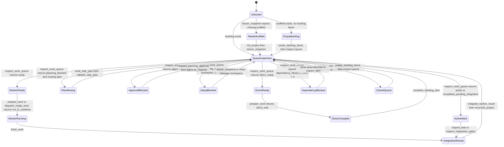

# Current MCP Workflow

This document describes how a host such as Codex or Claude should use the
current Platypus MCP tools. The MCP server owns deterministic project state
transitions; the host owns conversation, model turns, and any external worker
execution.

See [diagrams.md](diagrams.md) for state, data, responsibility, and roadmap
diagrams from additional perspectives.

## Host Guidance Resources

MCP hosts should list resources and prompts during setup and cache the guidance
for the active session. The server exposes the same deterministic guidance as
both readable resources and prompts so clients can choose the integration style
that fits their UI.

Resources:

- `platypus://guidance/workflow`: end-to-end host workflow and safety gates.
- `platypus://guidance/spec-driven-development`: goal intake, backlog
  shaping, task planning, dispatch, evidence, and integration loop.
- `platypus://guidance/project-status`: project inspection and setup blockers.
- `platypus://guidance/tool-preload`: optional phase-specific tool groups for
  hosts that defer tool schemas.
- `platypus://tools/core-schemas`: compact startup preload hints for common
  Platypus tool schemas. It points hosts to the live tool list instead of
  duplicating JSON Schema in documentation.
- `platypus://guidance/backlog-authoring`: declarative backlog authoring rules.
- `platypus://guidance/worker-handoff`: worker dispatch, handoff, progress, and
  completion flow.
- `platypus://guidance/integration-review`: review and integration gates.
- `platypus://guidance/recovery`: inspection and recovery commands.

Equivalent prompts are available as `platypus-workflow`,
`platypus-spec-driven-development`, `platypus-project-status`,
`platypus-tool-preload`, `platypus-core-schemas`,
`platypus-backlog-authoring`, `platypus-worker-handoff`,
`platypus-integration-review`, and `platypus-recovery`.

Tool preloading is optional and host-specific. Hosts can call
`inspect_toolsets`, read `platypus://tools/core-schemas`, or read
`platypus-tool-preload` for compact discovery metadata covering Startup,
Backlog Planning, Direct Execution, Worker Handoff, Evidence And Findings, and
Recovery. Toolsets are not required workflow steps or separate MCP servers.
These are advisory search hints and selectors unless the host explicitly
supports automatic schema registration. Hosts without preloading support should
use the same tools normally as the workflow requires them.

## Principles

- Start with `doctor_snapshot` or `inspect_status` when the project state is
  unclear.
- Prefer `inspect_queue_status` for quick queue triage and `inspect_work_queue`
  for executable backlog selection and lifecycle routing instead of guessing
  the next command.
- Keep backlog markdown declarative; runtime state belongs in
  `.platy/platypus.sqlite3`.
- Treat worker worktrees as isolated execution spaces until reviewed and
  integrated.
- Record findings and verification evidence instead of hiding limitations in
  chat.

## Workflow State Machine

Use this state machine when deciding the next tool. The MCP server supplies
facts and deterministic transitions; the host model supplies product judgment
and concrete content.



| State | How to identify it | Required next action |
| --- | --- | --- |
| Unknown | Session start or stale chat context | `inspect_session` |
| Needs scaffold | `doctor_snapshot` reports missing project files | `init_project`, then rerun `doctor_snapshot` |
| Empty backlog | `inspect_work_queue` reports no items | Host decides concrete items, then `create_backlog_items` and `inspect_work_queue`; `validate_backlog` is optional after successful typed creation |
| Dependency blocked | `inspect_work_queue.inventory.dependency_blocked_count > 0` | `inspect_item` on the blocked item; close or create its dependencies |
| Plan missing | `inspect_work_queue.items[].recommended_tool == "write_task_plan"` | Host writes exact plan with `write_task_plan`, then `validate_task_plan` |
| Approval blocked | `queue_state == "approval_blocked"` | `request_planning_approval`, then `approval_respond` |
| Config blocked | `queue_state == "config_blocked"` | `doctor_snapshot` and the reported recovery action |
| Workspace blocked | `queue_state == "workspace_blocked"` | Commit, stash, or finish the manager-workspace change before worker dispatch |
| Direct ready | `queue_state == "direct_ready"` | edit manager workspace, verify, `complete_backlog_item`; optional `prepare_work` only for guidance |
| Direct claimed | `queue_state == "active"` with `active_lease_id` | continue, renew, or release the task-scope lease before starting duplicate direct work |
| Worker ready | `queue_state == "ready"` | `prepare_work` for one item or `dispatch_ready_work` for batch handoff |
| Active work | `queue_state == "active"` or existing task id | `inspect_task`, `inspect_task_events`, `finish_work`, or recovery action |
| Pending integration | `queue_state == "completed_pending_integration"` | `inspect_integration_gates`, then `integrate_worker_result` |
| Closed queue | only closed items remain | Host decides whether to create more work; if yes, `create_backlog_items` |

### Lifecycle Output States

Queue tools emit exactly these queue states:

| Queue state | Meaning | Follow-up |
| --- | --- | --- |
| `direct_ready` | direct manager-workspace work is executable | edit, verify, `complete_backlog_item`; optional `prepare_work` only for guidance |
| `ready` | worker handoff can be prepared | `prepare_work` or `dispatch_ready_work` |
| `planning_blocked` | a required task plan is missing or invalid | `write_task_plan`, then `validate_task_plan` |
| `approval_blocked` | planning approval is required before execution | `request_planning_approval`, then `approval_respond` |
| `dependency_blocked` | backlog dependencies are still open | `inspect_item` and close or create the dependencies |
| `config_blocked` | project setup blocks worktree dispatch | `doctor_snapshot` and the reported recovery action |
| `workspace_blocked` | manager workspace changes block worker dispatch | commit, stash, or finish those changes |
| `active` | a task lifecycle or direct-work lease already exists | inspect the active task, or use `list_leases`, `renew_lease`, or `release_lease` for direct claims |
| `completed_pending_integration` | worker output is complete and awaiting integration | `inspect_integration_gates`, then `integrate_worker_result` |

`prepare_work.prepared_state` is `direct_guidance`, `worktree_prepared`,
`mixed_prepared`, or `not_prepared`. `direct_guidance` is response-local: it
creates no task, assignment, event, or worktree, so `complete_backlog_item` is
the next durable transition. It also returns `state_persisted=false` and
`durable_next_tool=complete_backlog_item` so clients do not need to parse prose.
`worktree_prepared` means a worker assignment and worktree were persisted; it
returns `state_persisted=true` and `durable_next_tool=finish_work`. A mixed
direct/worker response returns `mixed_prepared` and `durable_next_tool=null`;
route each returned `host_actions[]` by its `kind` and `next_tools`.
`not_prepared` means no selected item could be prepared and the host should
follow `next_action`.

Host action kinds are `direct_edit`, `run_in_worktree`,
`verify_or_record_risk`, `resolve_findings`, `integrate_result`,
`inspect_or_recover`, and `done`. Treat them as the exact next-step contract
returned by `prepare_work`, `finish_work`, or completion tools.

After successful direct completion, inspect the queue for the normal next item.
`reconcile_project` is optional for direct work and is meant for audit or
recovery: use it when a tool failed, state is unclear, verification or finding
evidence may be missing, or stale task lifecycle state needs inspection.

## Bootstrap

1. For a fresh project, run `platypus-mcp bootstrap <host> --root <project>
   --init-project` so host MCP configuration and repository guidance files are
   created in one step.
2. For an already initialized project, run `bootstrap <host>` for host config
   only, or call `init_project` from the MCP host if scaffold files are
   missing.
3. Run `doctor_snapshot` to check config, backlog directories, Git metadata,
   and recovery guidance.
4. Inspect workflow policy with `inspect_workflow_config`.

At the start of an MCP-host session, `inspect_session` can replace the separate
startup detector calls to `doctor_snapshot`, `inspect_status`,
`inspect_workflow_config`, `inspect_queue_status`, and `inspect_work_queue`
when it succeeds and the snapshot is fresh. Its default compact detail returns
headline facts and schema hints; pass `detail=verbose` only when the host needs
the full embedded payloads. Call the narrower tools after mutations, when the
host needs a detailed payload, or when a previous chat turn may be stale.
`inspect_session` and `inspect_work_queue` include
`schemas_likely_needed_next` with 1-4 likely next tool schemas. Claude hints
include literal ToolSearch selectors and a response-level batch selector.
Codex-style text-search hosts should use `codex_tool_search_query` or
response-level `host_neutral_tool_search_query`; opencode and other callers can
use `tool_name` or `host_neutral_query` values with their own discovery UI.
These fields are advisory discovery hints, not a guarantee that the host has
automatically registered every schema.

`init_project` also installs project-local agent and workflow guidance. That is
intentional: once an MCP host enters an initialized directory, normal goal
requests should naturally flow through Platypus instead of ad hoc edits.
The transparent steering layer is deliberately layered: MCP server
instructions/resources/prompts are the stable contract, `AGENTS.md` provides
generic agent guidance, and `CLAUDE.md` provides Claude Code guidance. Other
host-specific files should be added only after their local instruction
mechanism is verified.

## Backlog Shaping

1. Decide workflow strategy with the host model and user intent. Platypus MCP
   exposes facts, schemas, validation, and state transitions; it does not infer
   product intent from goal text.
2. Preview related work with `create_backlog_items` and `preview=true` when the
   host needs to show deterministic would-be IDs, target files, and markdown
   before changing the repository.
3. Persist selected work with `create_backlog_items` when related items should
   be created atomically, `create_backlog_item` for a full single-item schema,
   or `quick_create_backlog_item` for a compact common-field single item.
4. Use `update_backlog_item` for typed corrections or refinements after an item
   exists. Do this instead of hand-editing markdown when the change is a
   supported schema or section update.
5. After successful `create_backlog_item(s)`, inline validation has already
   passed. Call `inspect_work_queue` to continue. Run `validate_backlog` only
   after manual markdown edits or when an explicit audit result is useful.
6. Use `inspect_queue_status` for compact queue counts, top ready work, top
   blocked work, active tasks, and one-line queue-state descriptions.
7. Use `inspect_work_queue` when the host needs full runnable candidates,
   active task state, dependency-blocked items, closed items, task-plan state,
   setup blockers, and recommended tool parameters.
8. Use `get_backlog_item` when the host only needs the bounded markdown for one
   item. Use `inspect_item` when one backlog item needs full state: markdown
   sections, dependencies, closure state, task plan, findings, evidence, and
   the recommended next tool.
9. Use `list_backlog` only when a compact runnable-candidate list is enough.
   Use `queue_state` as the authoritative routing signal: `direct_ready` means
   the host should edit the manager workspace, verify, and complete with
   `complete_backlog_item`; `ready` means worker/worktree preparation is
   possible; blocked states identify the specific recovery path.

Validation does not make planning commits mandatory for direct work. Direct
items can edit the manager workspace and complete with
`complete_backlog_item`; call `prepare_work` only for optional guidance and
commit first only when the host wants a checkpoint.
Worker-handoff items need committed planning context before creating worktrees.
Use `commit_planning_artifacts` when backlog or task-plan files are the only
pending manager-workspace changes.

Minimum viable direct-edit loop for tiny, user-approved work:
`inspect_session`, `inspect_queue_status` or `inspect_work_queue`,
edit the manager workspace, run relevant verification, then
`complete_backlog_item`. When `inspect_work_queue.items[].prepare_work_optional`
is true, `prepare_work` is optional and only returns response-local guidance.
This is a traceability tradeoff: it avoids worktree overhead for small tasks
while still recording the durable completion. Use task plans, worker handoff,
findings, and integration gates for long-lived, parallel, or review-sensitive
product development.

### Minimal Direct Work Example

Use this path for sustained tracked work that is small enough to edit in the
manager workspace. It is not meant to replace a host's one-shot scaffold
command when the user explicitly wants disposable quick prototyping.

1. Create a tiny direct item:

```json
{
  "tool": "create_backlog_items",
  "arguments": {
    "items": [
      {
        "client_key": "docs_note",
        "title": "Document local setup note",
        "type": "docs",
        "area": "docs",
        "goal": "Add one setup note to README.md.",
        "owned_surfaces": ["README.md"],
        "acceptance": ["README.md explains the local setup note."]
      }
    ]
  }
}
```

The successful compact response includes the created ID, path, normalized
metadata, inline validation status, and `next_action`; it omits generated
Markdown unless `detail=verbose` or `preview=true` is used.

2. Call `inspect_work_queue`. If it returns `queue_state=direct_ready`, note
   `next_ready_item_id` and the first item's `lifecycle_mode=simple_direct`.
3. Edit `README.md` in the manager workspace and run the relevant check.
4. Complete the item with inline evidence:

```json
{
  "tool": "complete_backlog_item",
  "arguments": {
    "item_id": "PROJ-001",
    "summary": "Documented the local setup note.",
    "changed_files": ["README.md"],
    "verification_status": "passed",
    "verification_summary": "Documentation review passed.",
    "verification_refs": ["manual:readme-review"]
  }
}
```

The response includes `generated_evidence` and `evidence_behavior`. With the
default `record_auto_evidence=true`, Platypus records completion evidence and,
when verification fields are present, verification evidence. Explicit
`evidence_refs` are combined with automatic evidence; use
`record_auto_evidence=false` only when explicit evidence records already cover
the closure.

### Pi Happy Path

Pi keeps the common Platypus workflow behind a small command set so users do not
need to memorize the underlying MCP tool surface:

1. Run `/platy-refresh` or `/platy-ready` to inspect current queue state.
2. Run `/platy-direction` when product direction is missing or stale. The agent
   should ask concise questions and write durable answers to
   `docs/product.md`, `docs/architecture.md`, and `docs/testing.md`.
3. Run `/platy-standards` when implementation standards are missing or stale.
   The agent should capture module boundaries, code organization, test
   strategy, required verification commands, UI design language, commit/PR
   expectations, evidence expectations, and definition of done in
   `docs/engineering.md`.
4. Run `/platy-story-review <draft-or-item-id>` before executing vague or
   manager-proposed work. The agent should separate blocking issues from
   improvement suggestions, and use `platypus_create_backlog_items` with
   `preview=true` or `platypus_update_backlog_item` only after the revision is
   approved.
5. Run `/platy-plan-review [item-id]` before non-trivial work starts. The agent
   should state whether response-local direct planning is enough or whether a
   durable task plan is required by policy or user approval, then include
   expected surfaces, tests, risks, verification command, and completion
   evidence. Durable plans should be written with `platypus_write_task_plan`
   and validated with `platypus_validate_task_plan`.
6. If the queue is empty, run `/platy-plan`. The agent should inspect the
   session, ask for missing product direction, and then call
   `platypus_create_backlog_items` with concrete titles, goals, acceptance
   criteria, owned surfaces, execution paths, and planning gates.
7. Run `/platy-start` to ask the agent to work on the next ready item. The
   prompt names the target item and tells the agent to finish with
   `platypus_complete_backlog_item`.
8. Run `/platy-review-result [item-or-task-id]` after implementation and
   verification when the result needs an explicit review. The agent should
   compare changes to acceptance criteria, check verification, call
   `platypus_list_findings` and `platypus_validate_findings`, record required
   findings with `platypus_record_finding`, create approved follow-up items
   with `platypus_create_backlog_items`, and then choose
   `platypus_complete_backlog_item` for direct work or `platypus_finish_work`
   for worker handoff.
9. Run `/platy-complete` when implementation is done but the agent has not yet
   closed the item. The required fields are `item_id`, `summary`,
   `changed_files`, `verification_status`, `verification_summary`, and
   `verification_refs`.
10. Run `/platy-direction-revise` or `/platy-standards-revise` to revise
   captured guidance without rerunning the whole setup flow.
11. Run `/platy-doctor` when the queue is blocked or setup looks wrong.

These commands surface current state and exact tools, but they do not choose a
product direction for the user. The agent remains responsible for judgement and
for asking clarifying questions when the goal is underspecified.

The Pi package has a deterministic extension harness covering command prompt
generation, fake Platypus tool execution, binary-resolution recovery guidance,
project-root forwarding, and renderer snapshots for queue, creation,
completion, doctor, and empty states. Run `make pi-extension-test` while
iterating on Pi UI or command behavior; it is included in `make check`.
Run `make pi-feedback` to create a temporary Pi project, bootstrap the local
package and Platypus scaffold, validate core tools, and write a dry-run
`FEEDBACK.md`. Use `PI_DRY_RUN=0 make pi-feedback` for a live Pi/model exercise
that asks for structured feedback on setup, UI, workflow, schemas, result
review, and closure behavior.

### Pi End-To-End Example

This example is intentionally small but follows the full sustainable-development
shape. It starts from a product idea and ends with a closed direct backlog item:

```text
/platy-ready
/platy-direction
Goal: a small personal habit tracker for one user, built as a local web app.
/platy-standards
Use a simple module layout, keep verification as make check, and record
follow-up risks as findings.
/platy-plan
Create the first two concrete backlog items for product baseline and the first
static UI slice.
/platy-story-review PROJ-001
/platy-plan-review PROJ-001
/platy-start
```

After implementation and verification:

```text
/platy-review-result PROJ-001
```

The agent should inspect the item, changed files, verification result, and
findings. If the result is complete, it calls
`platypus_complete_backlog_item` with summary, changed files, verification
status, verification references, and any finding references. If the work exposed
risks or missing requirements, it records them with `platypus_record_finding` or
creates approved follow-up items before closing.

Backlog files should contain goal, implementation contract, acceptance
criteria, dependencies, and owned surfaces. They should not contain runtime
status, task attempts, PR metadata, or closure state.

When creating backlog items through tools, use the typed schema:

- minimal input: a meaningful `goal` or `title`; Platypus derives conservative
  defaults for missing title and goal, writes a visible "not specified"
  contract placeholder, and writes one neutral tracking criterion. Add a real
  implementation contract before delegated, complex, or long-lived work.
- rich input: explicit `title`, `goal`, `implementation_contract` or
  `contract`, and `acceptance` criteria when the work is complex or generated
  defaults would be too broad
- priority values: `P0`, `P1`, `P2`
- type values: `foundation`, `feature`, `safety`, `ux`, `test`, `docs`
- default values when omitted: priority `P1`, type `feature`, epic `general`
- omitting `epic` intentionally files the item under `general`; in projects
  with multiple epics, call `list_epics` and choose an explicit epic unless the
  item is truly cross-cutting or uncategorized
- Worker selection is runtime state. The manager or MCP host chooses the
  executor when preparing execution; Platypus does not create or configure
  agents.
- failed authoring calls include a specific `recovery_action`; follow it before
  retrying instead of falling back to manual markdown unless the recovery
  explicitly asks for a file edit
- use `list_epics` before assigning a non-default epic, and `create_epic` when
  a new grouping is needed
- use `client_key` plus `depends_on_keys` in `create_backlog_items` for
  dependencies between newly created items; the tool resolves those keys to
  concrete backlog IDs before writing files
- use `update_backlog_item` for supported changes to existing items; it
  validates the full backlog after writing and restores the previous item when
  validation fails
- closed items are protected from update by default; create a follow-up item
  unless the correction is intentional and `force_closed=true` is justified

Backlog items may include `external_refs` for intake and reporting surfaces
such as GitHub, Linear, Jira, GitLab, support tickets, specs, or local design
documents. These references are metadata only: the local backlog item remains
the executable snapshot for planning and dispatch. Each reference records a
provider, kind, stable id, and either a URL or locator, with optional import
timestamp and source hash.

## External Reporting

External trackers are never mutated implicitly. When a backlog item carries an
external reference, use:

1. `draft_external_report` to create a provider-neutral report from local
   backlog, task, and evidence state.
2. `request_external_report_approval` to make the intended external mutation
   explicit and durable.
3. Have the MCP host or approved provider plugin send the report after approval.
4. `record_external_report_dispatch` to record the send result, outbound
   reference, provider error if any, and external-report evidence.

This keeps provider credentials outside Platypus state while preserving an
auditable local record of what was approved and reported.

## Task Planning

Use `inspect_work_queue` to inspect task-plan state and setup blockers. The
MCP server does not infer whether an item is small or architecture-sensitive
from its title. Execution policy is durable and explicit:

- Project defaults live in `platy.yaml` under `workflow.execution`.
- Item overrides live in backlog item frontmatter as `execution_path` and
  `planning_gate`.
- `execution_path=direct_edit` means the host edits the manager workspace and
  finishes with `complete_backlog_item`.
- `execution_path=worker_handoff` means Platypus prepares an isolated worktree
  handoff for an external harness.
- `planning_gate=none` requires no task plan.
- `planning_gate=task_plan` requires a valid `backlog/plans/<ITEM>.yaml`.
- `planning_gate=approved_task_plan` requires a valid task plan and an approved
  planning approval record.

The legacy queue inputs `require_task_plan` and `require_planning_approval` are
compatibility hints only. They do not choose direct vs worker mode.

Task plans are strict YAML artifacts. They may contain requirements, a design
summary, owned surfaces, verification commands, and executable planned tasks.
They must not contain runtime fields such as status, completed_at, commit,
attempts, result, evidence, or worker diary comments. Use `inspect_task_plan`
and `list_task_plans` to review committed plans.

For review-sensitive work, request planning approval before dispatch:

1. Call `request_planning_approval` with one `item_id` for a task plan, or
   multiple `item_ids` for a backlog tranche.
2. Respond with `approval_respond`.
3. Set `planning_gate=approved_task_plan` on the relevant backlog item or
   workflow default.
4. Call `inspect_work_queue` or `dispatch_ready_work`.

Planning approval records live in local approval state, not backlog item
frontmatter. `reconcile_project` reports planned task lifecycles that were
created without an approved planning gate.

## Dispatch And Worker Handoff

1. Call `inspect_work_queue`.
2. If it requires a task plan, use the recommended task-plan tool first.
3. If policy requires reviewed planning, call `request_planning_approval`,
   approve it, and retry the queue or dispatch tool.
4. Use the `recommended_tool`, `reason`, and `params` from `inspect_work_queue`
   to choose the next lifecycle command.
5. Execution is host-managed. `manual_handoff` prepares the task, assignment,
   worktree, and bundle for the MCP host or a human-managed worker. `auto`
   resolves to the same host-managed handoff path.
6. For normal execution, call `prepare_work` when response-local direct
   guidance or worker handoff preparation is useful; it either returns
   `direct_edit` guidance or prepares an assignment, worktree, and bundle for
   host-run worker execution. Direct work creates no task, assignment,
   worktree, or durable prepared marker; `complete_backlog_item` is exposed as
   `durable_next_tool` and is the next persisted transition. For
   `direct_ready` items with `prepare_work_optional=true`, the host may edit
   the manager workspace and finish with `complete_backlog_item` without this
   call.
7. For lower-level batch dispatch, call `dispatch_ready_work`; it only accepts
   items whose effective policy is `execution_path=worker_handoff` and whose
   planning gates are satisfied. It dispatches one or more runnable worker
   items and prepares assignments, worktrees, and bundles. Pass
   `execution_mode=manual_handoff` when you want to be explicit about the
   host-managed handoff path.
8. For low-level debugging only, call `dispatch_next_work` and then immediately
   `prepare_worker_handoff`; do not run a worker from a bare task id.
9. Give the assignment bundle, completion contract, and worktree path to the worker harness.
10. Mark the worker active with `start_worker_task` when you need an explicit
   running transition.

For direct work, edit the manager workspace and finish with
`complete_backlog_item`. The `prepare_work` direct action is response-local
guidance, so queue inspection continues to show `direct_ready` until completion
is recorded. `complete_backlog_item` records direct completion evidence, a
backlog event, and optionally a closure commit for explicit changed files. For
worker work, the worker should operate in the assigned worktree, not in the
manager workspace.

When multiple sessions might edit the same direct item, optionally call
`acquire_lease` with `scope=task` and `target_id=<item id>` before editing.
This creates a lightweight active claim without a worker task. Queue inspection
surfaces the claim through `active_lease_id` and compact `active_leases`; use
`renew_lease` to keep working or `release_lease` after completion. This claim
is optional for small solo edits and should not replace `complete_backlog_item`.

After successful direct completion, call `inspect_work_queue` to continue.
Run `reconcile_project` only when recovery guidance is needed, state is
unclear, or an audit pass is desired.
Manual handoff is still lifecycle-tracked: after the host or external worker
edits the worktree, call `start_worker_task` if a running transition is needed,
then `finish_work`. Follow its `host_action` to verify, record or resolve
findings, integrate, recover, or continue to the next item.

## Worker Progress And Result

Use `record_worker_progress` for safe progress summaries. Use
`inspect_worktree_changes` to review bounded worktree changes. Worker
assignments finish with `finish_work`, including:

- terminal status
- summary
- changed files
- verification status
- findings or `findings_reviewed=true`

For same-session host-driven edits, `finish_work` can complete a
prepared assignment directly; it auto-starts prepared assignments by default.
Set `auto_start_if_prepared=false` when strict lifecycle enforcement is needed.
For direct manager-workspace edits returned by `prepare_work`, do not call
`finish_work`; no direct task or assignment exists. Call `complete_backlog_item`
with item id, summary, changed files, verification status, and any evidence or
finding references.
Use `inspect_integration_gates` only for completed worker task/worktree
integration when the host needs a read-only explanation of remaining blockers.
Direct manager-workspace backlog items do not use integration gates; complete
them with `complete_backlog_item`. Required findings block only while they are
open; `accepted`, `deferred`, `resolved`, `rejected`, and `duplicate` are
explicit dispositions that clear the integration gate.

When a verification command is configured in the assignment bundle, run
`run_task_verification` after completion to execute it in the task worktree and
persist verification run evidence.

If verification did not pass, record explicit verification evidence or findings
so reconciliation can report the remaining gap.

## Evidence, Findings, And Reconciliation

- For direct manager-workspace completion, prefer the automatic evidence fields
  on `complete_backlog_item`: pass `verification_status`,
  `verification_summary`, and `verification_refs` while leaving
  `record_auto_evidence` omitted. This records completion and verification
  evidence in one durable transition.
- Use `record_verification_evidence` for worker-handoff verification, extra
  independent evidence, or recovery when a direct completion call could not
  record evidence.
- Treat `complete_backlog_item.warnings` as review prompts, not hard failures.
  Missing or unchanged `changed_files` can be valid for non-file, exploratory,
  or already-committed direct work, but the warning should be explained through
  evidence or the completion summary. Untracked paths are detected through Git
  status, and unchanged Platypus-owned files such as backlog metadata do not
  produce a noisy changed-file warning.
- Use `record_evidence` kinds consistently:
  - `note`: generic rationale, manual review note, or completion context
  - `file_summary`: changed-file or inspected-surface summary
  - `verification`: command result, manual verification result, or skipped
    check rationale
  - `commit`: Git commit hash or closure/verification trailer evidence
  - `worker_finding`: risk, limitation, or follow-up reported by a worker
  - `manager_disposition`: accepted, deferred, resolved, rejected, or
    duplicate decision about a finding
  - `external_report`: imported issue, PR review, CI report, or external audit
- Use `record_finding` for limitations or required follow-up work.
- In Pi, `/platy-review-result [item-or-task-id]` is the normal post-work
  review shortcut. It asks the agent to inspect the item or task, compare
  acceptance criteria with the implementation, validate findings, record
  required findings or approved follow-up items, and only then call the correct
  completion tool.
- Use `complete_backlog_item` to close direct manager-workspace work.
- Use `validate_findings` before claiming a task is handled.
- Use `integrate_worker_result` to bring a completed verified worktree back
  into the manager workspace according to `workflow.integration`.
- Use `reconcile_project` to find missing verification evidence, open findings,
  closure gaps, and evidence attached to missing or incomplete task
  lifecycles.

Recovery tools separate inspection from repair:

| Scenario | Inspect | Repair |
| --- | --- | --- |
| Missing scaffold or Git setup | `doctor_snapshot` | `init_project`, `git init`, or create the initial commit named in the failed check |
| Dirty manager workspace blocks worktree dispatch or integration | `inspect_work_queue` or `inspect_integration_gates` | commit, stash, or revert the listed manager-workspace paths, then retry the blocked tool |
| Successful direct completion | `complete_backlog_item` result | call `inspect_work_queue`; run `reconcile_project` only for audit or unclear state |
| Worker task is complete but not integrated | `inspect_integration_gates` | resolve reported gates, then call `integrate_worker_result` |
| Completed task has no verification evidence | `reconcile_project` | `record_verification_evidence` or `run_task_verification`, then rerun `reconcile_project` |
| Required finding is still open | `reconcile_project` or `validate_findings` | `update_finding_disposition` with accepted, deferred, resolved, rejected, or duplicate |
| Evidence references a missing task | `reconcile_project`, then `list_evidence` | record replacement evidence against a valid task or ignore the orphaned evidence in the next completion |
| Closed item still has a nonterminal task lifecycle | `reconcile_project` | do not reopen the backlog item; inspect the task for audit and treat the Git/direct completion closure as authoritative until a lifecycle cleanup flow is available |
| Integration commit lacks closure or verification trailers | `reconcile_project` | create a corrected integration commit with `Platypus-Closes` and `Platypus-Verification`, then rerun `reconcile_project` |

## Managed Integration

Managed integration from task worktree back into the manager workspace is
handled by `integrate_worker_result`. The tool requires a completed task, a
recorded worktree, a clean manager workspace, and verification evidence by
default.

The tool uses `workflow.integration.merge_style` from `platy.yaml` and creates
closure commits with `Platypus-Closes` and `Platypus-Verification` trailers.
If integration cannot proceed, the tool returns structured recovery guidance.
